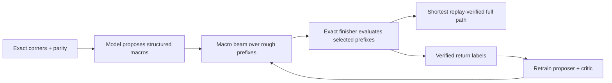

The path forward is not “train a larger version of the current value model.” It is to build a finishable, return-supervised macro beam: every frontier state can be converted into a complete verified solution, and the model learns which macro sequences reduce that final solution length.

The model then searches for savings, rather than trying to predict an uncertain distance across a 100+ move primitive horizon.

## What the experiments have established

We actually have two different problems:

1. Autonomous solvability is already demonstrated. The factorized finisher model solved 1,012/1,012 normalized puzzles with beam search, but required roughly 700 primitive moves per puzzle. [The full result is documented here.](C:/Users/and-l/cayley/cube666/MACRO_POLICY_TRAINING.md:3)
2. Competitive path quality is unsolved. The best verified file is 171,019 moves, and the model has only found six moves of real-window improvement. [Latest result.](C:/Users/and-l/cayley/EXPERIMENTS.md:1415)

The evidence says:

- The network can represent and execute long algebraic solutions when labels are clean.
- A larger model does not repair bad cost geometry.
- Teacher imitation reproduces existing trajectories but cannot discover cheaper ones.
- State-only Bellman bootstrapping creates optimistic false basins.
- Local action ranking can improve while full beam generalization gets worse.
- The missing ingredient is independently verified, multi-step, off-policy return supervision. [Failure diagnosis.](C:/Users/and-l/cayley/EXPERIMENTS.md:1441)
- Production KMC completion is path-dependent: identical cube states with different prefixes can finish at different lengths because of insertion and cancellation opportunities. [Context diagnosis.](C:/Users/and-l/cayley/EXPERIMENTS.md:1253)

So my priority ordering is:

1. Better return labels and oracle instrumentation.
2. A correct search objective.
3. Structured state/action representation.
4. Only then, model scale.

## The central reframing: make every beam state terminal

After exact corner and parity normalization, let:

- \(p\) be the current rough macro prefix;
- \(s(p)\) be its six-cluster state;
- \(C(p)\) be the length of the complete replay-valid solution obtained by running the exact insertion finisher after prefix \(p\).

Then the exact advantage of appending macro \(a\) is:

\[
A(p,a)=C(p)-C(pa)
\]

This label directly answers the real question: “Does this action lead to a shorter complete solution?”

For multiple steps:

\[
C_H(p)=\min_{a_1,\ldots,a_H} C(pa_1\ldots a_H)
\]

Every \(C_H\) target is associated with an actual completed, replay-verified path. There is no neural value bootstrapping and no imaginary eight-move “advantage” caused by underestimation.

This differs fundamentally from the existing experiments:

- The finisher is not merely appended after an imitation rollout.
- It supplies the terminal cost throughout training and search.
- The beam does not need to hit the identity.
- A zero-length prefix is always available, so the system can never do worse than its classical fallback.
- Search becomes anytime: every newly evaluated prefix is another complete candidate solution.

Conceptually:

The hard learned component is rough-path optimization. Exact setup, permutation application, completion and replay verification remain deterministic.

## The training-data engine

This is more important than the first architecture.

### 1. Instrument KMC instead of querying it one candidate at a time

The Rust solver already maintains substantial internal rough-search populations but normally emits only a winner. Modify it to export:

- diverse rough prefixes at several depths;
- rough-state endpoints;
- analytic residual features;
- exact finished path and length for the top candidates;
- seed, frame, beam and annealing configuration;
- both empty-context and original-prefix completion where requested.

One KMC run could then produce dozens or hundreds of ranked examples. That amortizes the expensive rough search and gives comparable candidates generated under the same conditions.

The first pilot should be approximately:

- 1,000 independently generated normalized roots;
- 32–64 candidates per root;
- learned proposals, KMC proposals, geometric proposals and cost-matched random controls;
- cheap completion for all;
- medium or wide completion for near-ties, disagreements and uncertain candidates.

Do not immediately scale to millions. First establish that the candidate pool contains meaningful improvements.

### 2. Keep labels comparable

Previous labels were contaminated when different proposal families received different completion budgets. The new dataset contract must fix:

- completion beam;
- annealing budget;
- seeds and frames;
- number of completion attempts;
- prefix-context semantics.

If deployment uses the best of four completion attempts, the target should be the minimum of the same fixed four attempts—not an uncontrolled mixture.

Split by root scramble before generating candidates. No candidates, prefixes or descendants from one root may cross train/evaluation splits.

### 3. Use active Expert Iteration

After the initial model:

1. Run its beam on fresh roots.
2. Save states it retains, states it wrongly discards and high-uncertainty candidates.
3. Complete those candidates independently.
4. Add the verified returns.
5. Retrain.
6. Repeat.

This is the appropriate form of Expert Iteration: a slow planner continuously improves the fast policy, rather than merely imitating a fixed teacher. [Expert Iteration](https://arxiv.org/abs/1705.08439) and DeepCubeA’s goal-backward approximate value iteration both support planner-generated supervision, although our terminal oracle must compensate for the much deeper 666 geometry. [DeepCubeA](https://www.nature.com/articles/s42256-019-0070-z)

## The model

I would begin around 30–60 million parameters. A billion-parameter model is not justified.

### Geometry trunk

Represent the corner-normalized state as six 24-position permutation orbits. Each piece token should include:

- orbit and position;
- target position;
- current cycle ID and cycle length;
- position within the cycle;
- misplaced indicator;
- exact unrestricted three-cycle count;
- small pattern-database distances.

Use a shared orbit encoder, followed by cross-orbit attention. The cross-orbit part is essential: short solutions come from moves that make progress across several clusters simultaneously. The old factorized sum-of-six value is excellent for isolated finishing, but it cannot value cross-cluster primitive savings correctly.

### Separate geometry and prefix context

Do not force one model to learn everything from a few hundred production labels. Decompose completion cost into:

\[
J(p,s) \approx V_{\text{geometry}}(s)-B_{\text{context}}(p,s)
\]

- \(V_{\text{geometry}}\) learns append-only or empty-context completion from a large state-diverse corpus.
- \(B_{\text{context}}\) learns the insertion/cancellation bonus of the actual prefix.
- The context model receives the reduced primitive prefix, recent moves and exact insertion-frontier descriptors.
- The final action ranker jointly sees root state, child state, macro effect, primitive cost and prefix context.

This is much more data-efficient than asking a transformer trained on 432 rows to learn both the global cube geometry and the insertion algorithm.

### Structured action proposal

Avoid another opaque 30,000–50,000-way classifier. High-value actions are often globally unique.

Use two stages:

1. A cheap proposer generates 256–2,048 candidates from:

   - factorized commutator/template parameters;
   - the existing autoregressive macro generator;
   - analytic cycle-reduction candidates;
   - KMC-derived macro families;
   - controlled random mutations.

2. A joint state-action cross-encoder reranks them using the exact macro effect on all six clusters.

Every proposed word is compiled and replayed before it is eligible. Keep the action grammar inverse-closed.

Q* search demonstrates why action-conditioned values and meta-actions can be much more search-efficient than separately evaluating every child, but our very large structured vocabulary still calls for proposal followed by joint reranking. [Q* search](https://arxiv.org/abs/2102.04518)

### Exact heuristic anchors

Build several small pattern databases. Tracking five labeled positions in one 24-piece orbit produces:

\[
24P5 = 5{,}100{,}480
\]

states—about 5 MB at one byte per state, before indexing overhead. Multiple five-piece tables are practical.

Use:

- `max(PDB_i)` as a legitimate lower bound;
- the whole PDB vector as model input;
- PDB-distance prediction as an auxiliary task;
- exact cycle statistics as additional features.

Pattern databases were decisive in optimal Rubik search because they provide exact projected distances instead of learned guesses. [Korf’s Rubik’s Cube pattern-database work](https://www.cs.princeton.edu/courses/archive/fall06/cos402/papers/korfrubik.pdf)

## Training objectives

The primary loss should be candidate-set ranking, not next-action cross-entropy.

For every root candidate set:

- regress verified completed cost;
- use pairwise/listwise ranking weighted by the actual move difference;
- strongly train distinctions near the beam cutoff;
- add explicit hard negatives where the previous model predicted unrealistic savings;
- train a distribution or several quantiles across seeds/configurations;
- predict uncertainty and data support.

For cost minimization, the search should be conservative:

\[
\widehat{S}_{\text{safe}}
=
\operatorname{mean}(\widehat{S})
-
\beta\,\operatorname{std}(\widehat{S})
\]

where \(S\) is predicted savings. Uncertainty reduces claimed savings. Equivalently, uncertain candidates receive a higher predicted cost.

This is the cost-minimization analogue of conservative offline RL: unsupported actions must not receive unrealistically favorable values. That is an inference from the CQL principle, with signs reversed because we minimize cost rather than maximize reward. [Conservative Q-Learning](https://proceedings.neurips.cc/paper/2020/hash/0d2b2061826a5df3221116a5085a6052-Abstract.html)

A beam-aware loss should also be added after the basic ranker works: penalize the first layer where an oracle-good trajectory falls outside the beam, rather than treating all local mistakes equally. This follows the motivation of direct beam-search optimization. [Beam-search optimization](https://aclanthology.org/D16-1137/)

## Deployment search

The production search should be a macro beam approximately 10–30 decisions deep, not a primitive beam hundreds of decisions deep.

At each layer:

1. Generate structured macros.
2. Apply them exactly.
3. Remove duplicates and immediate inverses.
4. Rank using path cost, conservative predicted remaining cost and policy prior.
5. Run the exact finisher on the best 32–128 prefixes.
6. Update the verified incumbent.
7. Continue while predicted or verified improvements remain possible.

The score can resemble policy-guided heuristic search:

\[
g(p)+h_\theta(p)-\alpha\log \pi_\theta(p)
\]

but the verified finisher cost should remain the terminal authority. Policy-guided heuristic search has shown that combining policy and heuristic signals is materially stronger than relying on either alone. [Policy-Guided Heuristic Search](https://arxiv.org/abs/2103.11505)

Multiple macro horizons should be allowed. Short options are useful near the goal; longer options can cross valleys at small beam budgets. Adaptive Subgoal Search reports the same general trade-off and benefits from mixing subgoal distances with verification. [Adaptive Subgoal Search](https://arxiv.org/abs/2206.00702)

Beam one million should be a late-stage scale test. It is useful only after the model retains verified-good trajectories at smaller beams. The current scorer merely spends more compute exploring its own optimistic errors.

## The decisive acceptance gates

| Gate | Measurement | What failure means |
|---|---|---|
| Oracle ceiling | Best wide-completed path among 256 diverse candidates | If it barely beats KMC, the action/search space is inadequate; no ranker can reach 110k |
| Label fidelity | Cheap/medium shortlist recall of wide top candidates | If poor, cheap KMC costs may only be used for diversity |
| Ranker | Held-out top-16 recall and regret against wide labels | If poor, fix representation/data before beam search |
| Beam retention | Layer at which the oracle trajectory is evicted | Separates proposer failure from critic failure |
| Full hybrid | 100 untouched PIDs, model prefix plus exact finisher | Must produce strict verified improvements without post-selection leakage |
| Score ceiling | Best-of-search full lengths | Determines whether action grammar must expand |

Suggested numerical first gates:

- Candidate pool improves the matched KMC control by at least 10 moves on average over 100 fresh roots.
- Held-out ranker top-16 recall at least 80%, with no more than two moves of mean regret against its labeled candidate pool.
- Clean depth-6 gate at least 7/8, followed by a larger unseen depth-8 gate.
- On 100 untouched PIDs, at least 25 strict wins and at least five moves mean saving, with zero submission regression because the incumbent remains a fallback.
- Only then scale beam, data and model.

Most importantly, measure the oracle ceiling before spending weeks training. If the best paths present in the candidate pools average 160 moves, a perfect model still cannot produce 116.

## What 110k really demands

The current total is 171,019, mean 168.99. A 110k score corresponds to roughly 116 moves on fully mixed states—about 1.13× the 102.2-move counting floor. It is not the 666 analogue of the 109k cube555 artifact; the latter is about 1.59× its counting floor. [Detailed calculation.](C:/Users/and-l/cayley/CUBE555_VS_CUBE666_COMPARISON.md:207)

Therefore I would use milestones:

- 160k: learned search reliably improves KMC.
- 145k: meaningful cross-cluster planning.
- 130k: strong global macro optimization.
- 110k: near-optimal research target requiring an exceptionally strong proposal space and search oracle.

## What I would do first

The next implementation phase should be:

1. Patch the Rust KMC solver to export diverse internal rough candidates and uniformly completed returns.
2. Implement the finishable-prefix objective \(C(p)\) and an evaluation harness with root-disjoint splits.
3. Run the 100-root oracle-ceiling experiment before training anything.
4. Build five-piece pattern databases and exact cycle features.
5. Train the first geometry/context-decomposed joint action ranker.
6. Run one Expert Iteration cycle on model-beam frontier states.
7. Promote to large beam only after the clean return-ranking and retention gates pass.

I believe this is the highest-probability route. Better labels are necessary, but the deeper change is that the labels must measure verified final path cost for counterfactual macro prefixes. Once that exists, model scaling becomes meaningful; before it, a larger network will simply learn the current errors more confidently.