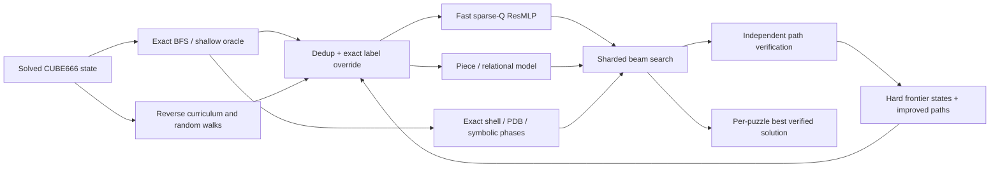
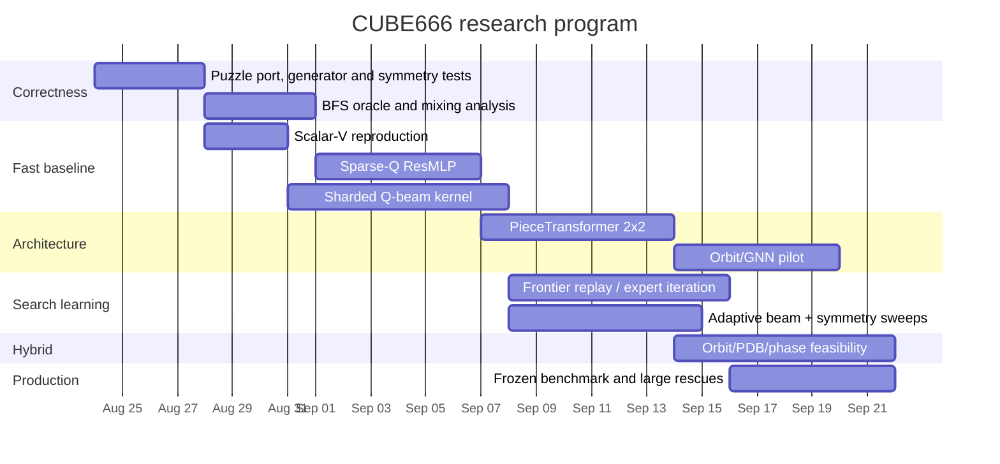

# Building a CUBE666 Solver with Neural-Guided Beam Search

## Executive summary

The strongest conclusion from the repository is that **CUBE666 should not be approached as “CUBE444 with a larger MLP and a wider beam.”** The 4×4×4 work already found that the limiting variable moved from training loss to **search-relevant ranking quality and inference economics**: a 3.3M-parameter value MLP was as useful as a 15M model while being about three times faster, Bellman value-scale collapse was benign when ranking remained good, symmetry diversity bought substantial improvements, and inference rather than training dominated total cost. Later, a piece-token transformer trained with a sparse-Q objective beat the repo's ResMLP-V solution on 916/1043 4×4×4 puzzles, with a median six-move margin, directly challenging the previous assumption that architecture was no longer the bottleneck. fileciteturn21file0L2-L2 fileciteturn29file0L2-L2

The most important unanswered experiment in the repo is also the first experiment I recommend for CUBE666: **separate architecture from objective**. The repo explicitly proposes a 2×2 comparison of ResMLP versus PieceTransformer and walk-depth MSE versus sparse-Q, but the cheap/high-value cell is ResMLP + sparse-Q. On CUBE444, an action-value head could score all 24 children with one parent forward pass and was measured at an 8.3× wider effective beam than the scalar-V scorer at the same local budget; the PieceTransformer was substantially slower. For CUBE666, whose action set should be verified from `puzzle_info.json` but is naturally inferred as 36 quarter-slice generators, this **Q-over-actions formulation becomes even more attractive**, because naïve V scoring requires a neural inference on every child. fileciteturn29file0L2-L2

My primary recommendation is therefore:

**Build a fast 36-output sparse-Q ResMLP first, then a sparse-Q piece-token transformer, and judge both by solution quality at fixed accelerator-seconds—not by MSE, epoch count, or equal beam width.** Generate exact near-goal anchors, corrected reverse/random-walk training pairs, and eventually search-derived hard negatives. Use 24 rotational/recolouring frames as either ensembles or controlled diversity, not blindly as training augmentation. Maintain a streaming, sharded beam implementation that never materializes all \(36B\) full successors simultaneously. Use exact state deduplication and independently replay every returned path.

The repository provides an unusually strong warning about the training data. Walk depth is an **upper bound, not ground truth**. On the 4×4×4 colour cube, the problem is worse than ordinary non-geodesic random walks because the observed colouring corresponds to a coset of underlying cube permutations; duplicate colour states can therefore acquire incompatible walk-depth labels. The repo measured conflicts in its walk-derived labels and implemented two fixes: deduplicate states keeping the minimum known label, and override labels wherever an exact BFS table knows the true distance. Sparse-Q is more resistant because it trains a local direction rather than merely regressing absolute walk depth, but even sparse-Q pairs need exact-oracle correction where possible. fileciteturn30file0L2-L2

The public CayleyPy project describes the 6×6×6 challenge as a graph on roughly \(10^{150}\) states and explicitly supports BFS, random walks, beam search and GPU/TPU execution; the current 4×4×4 repository says its colour-cube implementation is already parameterized for 5×5×5, **6×6×6 with state size 216**, and 7×7×7, with the primary low-level change being increased packed-state capacity. citeturn15view0 fileciteturn21file0L2-L2

One repository-access caveat matters: the connected repository snapshot I could inspect did **not** expose `CUBE555_VS_CUBE666_COMPARISON.md` under that exact filename despite exact-name/code/tree searches. I therefore do not invent findings from that file. The repo-specific analysis below is grounded in the current `cube444` analysis, handoff and experiment log; the A100 sparse-Q handoff; and the Megaminx beam/search records, including the explicit transfer notes for 5×5×5/6×6×6/7×7×7.

The research program I would prioritize is:

| Priority | Approach | Core hypothesis | R&D probability of materially beating a direct CUBE444-style V baseline at matched wall time* |
|---|---|---|---:|
| **Highest** | Sparse-Q ResMLP + huge beam | Objective and one-forward-per-parent economics matter more than architecture | **70–85%** |
| **High** | Sparse-Q PieceTransformer | Physical-piece relational structure supplies the missing ranking signal | **55–75%** |
| Medium | Orbit-aware graph/relational network | Explicit generator/orbit structure generalizes better at deep random states | **35–55%** |
| Medium | Search-trace Transformer | Learn beam/A* search dynamics rather than only distances | **25–45%** |
| High-risk/high-upside | Hierarchical neural-symbolic solver | Reduce CUBE666 into easier orbit/phase subproblems, then use exact/classical finishers | **50–70%** |

\*These probabilities are engineering priors, **not measured CUBE666 solve probabilities**. There is not yet enough CUBE666 evidence in the inspected material to claim an empirical success rate.

The key strategic point is that **beam width and heuristic quality are multiplicative**. A marginally sharper network can lose in production if it is 5–30× slower. Conversely, a Q-network that is slightly worse as a standalone predictor can win because it supports an order-of-magnitude wider search. Q* makes essentially the same observation in a more general search setting: an action-value network can estimate all actions in one pass and dramatically reduce the cost of large action spaces. citeturn23academia48



This loop—**exact anchors → learned heuristic → wide search → verified hard examples → retraining**—is much closer to the evidence in both the repo and the literature than training a large end-to-end solver and hoping beam width repairs its errors.

## Repository evidence and failure taxonomy

### What CUBE444 tells us about CUBE666

CUBE444 is especially relevant because it is already the same kind of state representation: a **colour cube rather than a permutation-labelled supercube**. In the 4×4×4 repository, the state has 96 facelets, six colours and 24 moves. Because multiple same-coloured stickers are indistinguishable, a visible state identifies a coset rather than a unique group element. This invalidated `invert_state`/NISS assumptions inherited from permutation puzzles and required whole-cube rotational symmetry to combine both a slot permutation and a colour relabelling. fileciteturn20file0L2-L2

The same implementation is explicitly described as transferable to 6×6×6 with `state_size=216` and `num_classes=6`. The existing packed TPU representation needs to grow accordingly; the handoff specifically warns that the old `PACK_SIZE=128` is already inadequate for 5×5×5 and therefore certainly inadequate for 6×6×6. fileciteturn21file0L2-L2

For planning purposes I would infer, but verify directly from CUBE666's `puzzle_info.json` before writing model code:

\[
N_\text{state}=6\cdot6^2=216,
\]

and, under the same `{f,r,d} × layer × direction` convention,

\[
|\mathcal A|=3\cdot6\cdot2=36.
\]

Do **not** silently encode those constants in the model. The exact generator table should be the source of truth.

The public CayleyPy README independently lists the 6×6×6 challenge, characterizes its graph as roughly \(10^{150}\), and describes neural beam search as one of the library's intended core operations. citeturn15view0

### Concrete prior failure modes

The most useful repo output is not any particular architecture; it is the catalogue of things that looked reasonable and failed.

| Failure mode | Concrete repo evidence | Why it matters for CUBE666 |
|---|---|---|
| **Walk depth treated as true distance** | Random-walk MSE saturated because long walks had highly noisy distance labels; duplicate colour states can carry inconsistent labels. fileciteturn22file0L2-L2 fileciteturn30file0L2-L2 | Larger cubes will spend even more training mass in deep/mixed regions where scramble length is a bad regression target. |
| **Conflicting walk labels** | Repo measured checkable walk-label errors, ties/inversions, and implemented dedup-min + exact overrides. fileciteturn30file0L2-L2 | Fix data before changing architecture; otherwise model comparisons are confounded. |
| **`V(solved)` not anchored** | 4×4×4 walk pretraining predicted `V(solved)≈4` because solved was absent from bulk walk data. Exact V0/d1 anchors fixed it. fileciteturn22file0L2-L2 | Explicit solved and shallow exact anchors are mandatory. |
| **Bellman scalar-value collapse mistaken for failure** | Bellman refinement drove deep V values from ~43 toward ~17, yet the more compressed model searched better; ordering/noise ratio improved. fileciteturn22file0L2-L2 | Never gate on absolute V scale alone. |
| **Training loss used as a search metric** | Repo repeatedly found that search-depth sweeps improved after nominal validation diagnostics had flattened. fileciteturn22file0L2-L2 | Primary validation must be ranking and fixed-budget search, not MSE. |
| **Larger value network assumed better** | 15M one-hot ResMLP was no better in solve rate than 3.3M while about 3× slower. fileciteturn21file0L2-L2 | For beam search, model latency directly trades against width. |
| **Wrong symmetry conjugation** | Initial move relabelling used the conjugation in the wrong direction and still passed 89/200 tests; corrected implementation passed 500/500. fileciteturn22file0L2-L2 | Symmetry bugs can generate plausible but subtly invalid training/search data. |
| **`num_classes=state_size` inherited from permutation puzzles** | This would silently build a 96-class colour encoder instead of six classes. fileciteturn22file0L2-L2 | Assert `num_classes == 6` in CUBE666 tests. |
| **Search accounting conflated “found” and “improved”** | A solver reported zero model solves because a verified path longer than fallback was logged as fallback. Separate `found`, `used`, `improved`, `fallback` counters fixed interpretation. fileciteturn22file0L2-L2 | Search diagnostics must distinguish feasibility, quality and merge contribution. |
| **Action shortlisting hurt quality** | On Megaminx, qshort reduced compute but one hard case regressed by about 15 moves relative to V-only; a bigger V-only beam recovered quality. fileciteturn24file0L2-L2 | Q-shortlisting should be recall-gated, not assumed lossless. |
| **Packed backpointer integer overflow** | A 23-bit parent index silently corrupted large-beam path reconstruction above \(2^{23}\) local parents; `found=True` but replay failed. fileciteturn24file0L2-L2 | CUBE666's likely larger beams make bit-budget assertions essential. |
| **Training-time symmetry augmentation diluted signal** | Megaminx rotation augmentation regressed despite valid symmetries, while inference-time symmetry diversity remained useful. fileciteturn26file0L2-L2 | Separate “equivariance as regularization” from “symmetry as multiple search starts.” |
| **Post-processing eventually saturates** | On CUBE444, exact local rewriting eventually found only eight moves after the best public solution; windows ≤10 were already geodesic. fileciteturn21file0L2-L2 | A large global deficit will not be repaired by local rewriting. |

Two findings deserve special emphasis.

First, **the transformer result changes the architectural prior**. The repo's best 4×4×4 transformer source won on 87.8% of test instances relative to its ResMLP-V search. But two factors changed simultaneously: the scorer became a piece-token transformer and the objective became sparse-Q. The repo correctly identifies this as an unresolved causal question and lays out the 2×2 experiment. fileciteturn29file0L2-L2

Second, **sparse-Q directly attacks the statistical defect of walk-depth regression**. Rather than asking a model to reproduce the noisy absolute number \(k\) attached to a random-walk state, a pivot supplies two local labels:

\[
Q(s,a_\text{undo})=p-1,\qquad
Q(s,a_\text{forward})=p+1.
\]

The repo's rationale is that the relative difference remains informative even when the absolute walk length is a poor proxy for shortest distance. It nevertheless keeps an absolute term because a global beam compares candidates from different parents, so purely within-parent pairwise ranking is insufficient. fileciteturn29file0L2-L2

### Dataset and evaluation lessons

CUBE444 random walks mixed very quickly: its mean Hamming distance reached the six-colour random baseline after only a few dozen moves. Consequently, almost all long-scramble test instances were effectively from one deep-state distribution rather than a meaningful ladder of difficulty. fileciteturn20file0L2-L2

The exact CUBE666 mixing time should **not** be copied from CUBE444. Measure it. Useful signals include:

\[
H(s,s_0),\qquad
H_\text{orbit}(s,s_0),\qquad
I(s_t;s_0),\qquad
\text{two-sample accuracy}(P_t,P_{t+\Delta}),
\]

plus action/orbit autocorrelation. For a six-colour 216-facelet state, an independent uniform-colour heuristic gives an expected 5/6 mismatch probability, or 180 mismatched facelets; because legal cube positions are highly constrained, that is only a convenient Hamming reference, not proof of uniformity over legal positions.

The repo's most robust evaluation rule is therefore the right one for CUBE666: **select models on fixed search budget**. The relevant quantity is something like

\[
\text{quality efficiency}
 =
\frac{\text{verified solutions of target quality}}
     {\text{accelerator-seconds}},
\]

or, for a leaderboard-style total-move score,

\[
J(\theta,B)=
\text{mean verified path length at fixed wall time},
\]

with unsolved instances receiving a predefined fallback penalty. This directly avoids the failure where a larger/slower model has better prediction metrics but produces worse final paths.

## Literature and design implications

The literature strongly supports neural-guided search, but not a single universal search algorithm.

### Classical heuristic and beam search

Korf's Rubik's Cube work remains the canonical example of **symbolic structure plus heuristic search**: IDA* guided by pattern databases storing exact distances for projected subproblems produced the first optimal solutions to random 3×3×3 instances. The important lesson for CUBE666 is not “use IDA*”; it is that exact information about a tractable quotient or projection can be far more valuable than an unconstrained learned scalar. citeturn11search1turn21search0

Beam search makes a different tradeoff: it deliberately drops states to cap memory and compute. Beam-stack search showed how to reintroduce systematic backtracking and obtain an anytime search that can eventually reach optimality, while later work developed a monotonic beam variant guaranteeing that increasing width does not worsen returned solution cost. citeturn23search5turn23search0

For CUBE666, conventional global beam remains attractive because the state transition function is exact, deterministic and highly vectorizable. I would use beam-stack or monotonic-beam ideas mainly for **diagnostics and hard-tail rescue**, not necessarily in the hottest production kernel.

### Deep heuristic learning and reinforcement learning

DeepCubeA is directly relevant: it trained from states generated outward from the goal and combined the learned estimate with search, solving all of its Rubik's Cube test configurations and finding shortest paths in 60.3% of them. Its central lesson is that reverse-from-goal training can overcome the extreme sparsity of direct reward. citeturn21search0

Reverse Curriculum Generation formalizes the same principle in RL: start where the goal is reachable, then expand the start-state distribution outward as competence improves. citeturn14search4 Curriculum Learning provides the broader optimization argument for ordering examples from easier to harder rather than sampling the entire problem distribution uniformly from the outset. citeturn14search0

For CUBE666, however, **scramble length should stop being the curriculum variable once mixing begins**. A better adaptive curriculum is based on solver competence: near-goal exact depth initially, then states where the current beam succeeds 20–80% of the time, followed by frontier states from failed beams. This preserves curriculum-learning benefits without pretending that a 300-step random walk is intrinsically “harder” than a 200-step walk after both have mixed.

### Action-value networks and large action spaces

Q* is particularly load-bearing for this design. It replaces child-by-child heuristic evaluation with a network that returns action-conditioned values in one forward pass. In a Rubik's Cube formulation with 1,872 meta-actions, Q* incurred less than a fourfold runtime increase despite a 157-fold action-space increase and was reported up to 129× faster than the corresponding A* approach in its experiments. citeturn23academia48

The CUBE444 repo independently rediscovered the practical version of this economics. Its ResMLP-Q head was measured at roughly 15.5 ms per \(B=65{,}536\) beam step versus 128.7 ms for child-scored ResMLP-V, allowing an approximately 8.3× wider beam in that setup. fileciteturn29file0L2-L2

That is why a 36-output CUBE666 Q scorer is my first architecture rather than merely a secondary policy head.

### Transformers and learning search itself

SearchFormer provides a different hypothesis: do not train only on final plans or scalar distance labels; train a Transformer on **the dynamics of a symbolic search algorithm**. It learned sequences representing A* search operations and then bootstrapped them to shorter search traces; on Sokoban it reported 93.7% optimal solves while using fewer search steps than the A* traces used to initialize training. citeturn21academia48

AlphaGeometry is an even stronger neuro-symbolic precedent. It generated synthetic data at scale, used a neural language model to propose difficult auxiliary constructions and left deterministic deductions to a symbolic engine; its search used beams, and the paper explicitly studies the impact of reducing beam size and depth. citeturn13search0

The implication for CUBE666 is not to serialize 216 colours and have a language model emit 100 moves autoregressively. That discards the exact simulator. A better use of a Transformer is to **predict search decisions**: action-Q values, frontier prioritization, phase transitions, or compressed search traces, while exact move application and verification stay symbolic.

### Graph neural networks and relational structure

Graph Networks were motivated by combinatorial generalization through explicit entity/relation representations. citeturn22academia36 Khalil et al. combined reinforcement learning with graph embeddings to learn heuristics for multiple combinatorial optimization problems, showing the broader value of encoding problem structure rather than flattening everything into a vector. citeturn22search0 XLVIN similarly uses neural algorithmic reasoning to perform planning-like computations in latent graph space. citeturn22search1

CUBE666 has precisely the sort of fixed relational structure where this might pay: cubies, stickers, generator cycles, face adjacency, common slice membership and closed move orbits. But the repo's Megaminx experiments are a warning that “more relational architecture” is not automatically better: several Transformer/graph-like alternatives failed to justify their throughput cost when the existing heuristic ordering was already strong. fileciteturn26file0L2-L2

A GNN therefore needs to beat the Q-MLP at **matched search wall time**, not just on top-1 action accuracy.

### MCTS and hybrid symbolic-neural planning

AlphaZero demonstrated the power of learned policy/value functions coupled to MCTS in large deterministic games. citeturn21search1 Segler et al. provide a particularly clean hybrid example outside games: policy networks guided an MCTS while symbolic chemistry rules preserved legal transitions. citeturn12search0

MCTS should nevertheless be a secondary CUBE666 branch. Its tree-selection and backup dependencies are harder to exploit on accelerators than a giant synchronous beam, and CUBE666 has no adversary or uncertainty requiring repeated statistical rollouts. An MCTS experiment is most useful as a **teacher**: use batched PUCT to produce improved action distributions on difficult frontier states, then distill those into the production Q scorer.

Attention-based learned combinatorial solvers similarly show that learned policies can provide useful search heuristics, but practical performance depends heavily on decoding/search strategy rather than architecture alone. citeturn23search2

The literature and repo evidence therefore converge on a hybrid principle:

> **Learn what is expensive to hand-design—ranking and phase selection—but retain exact state transitions, symmetry, deduplication, local exact tables and final verification symbolically.**

## Candidate architectures and search strategies

### Fast sparse-Q ResMLP with global beam

This is the **highest-priority approach**.

**Input.** Encode the CUBE666 state as `uint8[216]`, values 0–5. The simplest neural input is a lossless one-hot tensor \(216\times6=1296\) flattened features. Add optional low-dimensional fixed slot features such as face, row/column, generator-orbit ID and physical-piece type, but establish the pure one-hot baseline first.

**Output.** A vector

\[
Q_\theta(s)\in\mathbb R^{36},
\]

where \(Q(s,a)\) estimates the cost-to-go after taking action \(a\), or equivalently \(1+V(T(s,a))\). The exact action dimension must come from the generator table rather than a literal constant.

**Loss.** Start from corrected sparse-Q:

\[
L_{\text{sparse}}
 =
\sum_{a\in A_\text{labelled}}
\rho\!\left(Q_\theta(s,a)-y_a\right),
\]

with Huber or MSE, where only undo/forward actions from a pivot are initially supervised. Add exact near-goal supervision and a small global calibration term:

\[
L
 =
L_{\text{sparse}}
+\lambda_e L_{\text{exact}}
+\lambda_c L_{\text{cross-parent-cal}}
+\lambda_s L_{\text{sym}}.
\]

The cross-parent term matters because beam selection is global. Pure pairwise ranking can produce perfect within-parent order yet incomparable scores across different parents—the exact concern documented in the repo. fileciteturn29file0L2-L2

**Training data.** Use four streams: exact BFS states; corrected non-backtracking random-walk pivots; verified solution trajectories; and later beam-frontier hard negatives. Whenever the BFS oracle recognizes a pivot or child, exact distance overrides the weak label. Deduplicate identical visible states and keep the smallest known upper bound. fileciteturn30file0L2-L2

**Search.** For every beam parent, one network call emits all action scores. Take the global top candidates after inverse-move pruning and exact duplicate removal. An action top-\(r\) shortlist can reduce state generation further, but make \(r\) adaptive and measure recall before enabling it in production.

Suggested initial hyperparameters:

| Hyperparameter | Initial sweep |
|---|---|
| Trunk width | 2048/512 × 2; 4096/1024 × 2 |
| Parameters | target 4–12M |
| Q outputs | inferred generator count, likely 36 |
| Batch | largest power of two maintaining throughput, likely 16k–64k |
| Optimizer | AdamW |
| LR | \(1\mathrm{e}{-4}\) to \(1\mathrm{e}{-3}\) |
| Huber \(\delta\) | 1, 2, 4 |
| Exact-anchor fraction | 5%, 10%, 20% |
| Sparse-Q / exact weighting | 1:0.25 through 1:2 |
| Symmetry consistency | 0, 0.01, 0.05 |
| Action shortlist \(r\) | 4, 8, 12, full |
| Beam | \(2^{14}\) through \(2^{22}\), larger only sharded |

**Advantages.** Highest throughput, simple TPU/JAX port, directly addresses the 36-way expansion tax, easy to distill and ensemble.

**Likely failures.** Deep Q values may lose cross-parent calibration; sparse-Q can still encode false ordering from non-geodesic walks; top-\(r\) pruning can destroy the one useful branch; an MLP may fail to exploit reusable physical-piece relationships.

**Estimated resources.** Rough planning estimate: 10–30 A100/H100-equivalent GPU-hours for initial training and 50–300 accelerator-hours for the first meaningful beam sweeps. Training should remain cheaper than search if the 4×4×4 economics persist. These are planning estimates, not measured CUBE666 numbers.

### Sparse-Q PieceTransformer

This is the architecture-vs-objective test required by the repo evidence.

For a 6×6×6 cube, a physical-piece tokenization naturally contains 8 corner pieces, \(12(6-2)=48\) wing pieces and \(6(6-2)^2=96\) centre pieces: **152 piece tokens covering all 216 stickers**. Derive these groups from generator move signatures rather than hardcoding geometry, exactly as the repo did for 4×4×4. In its 4×4×4 derivation, the corresponding tokenization was 8 corners + 24 wings + 24 centres. fileciteturn29file0L2-L2

A token receives:

\[
e_i =
E_\text{colors}(\text{stickers in piece } i)
+
E_\text{slot}(i)
+
E_\text{piece-type}(i)
+
E_\text{orbit}(i).
\]

Use a 4–6-layer pre-LN Transformer with \(d=256\) or 384, 8 heads and FFN ratio 4 as the first sweep. A pooled token predicts the 36 Q values.

Keep the **same sparse-Q/exact data and objective as the ResMLP** so the comparison isolates architecture.

Inference should still be one forward per parent; however dense attention over ~153 tokens is far more expensive than the MLP. The CUBE444 handoff already found its PieceTransformer much slower than the Q-MLP, so the architecture must demonstrate a meaningful ranking gain at *lower beam width* to justify deployment. fileciteturn29file0L2-L2

Hyperparameters worth tuning are layers {3,4,6}, \(d_\text{model}\) {192,256,384}, heads {6,8}, centre-token compression, pooling method, action-factorized head versus flat 36-way head, and shared vs separate embeddings for symmetric orbit types.

**Advantages.** Encodes actual cubie structure, gives attention a direct mechanism to compare distant but functionally related pieces, and is the most faithful extrapolation of the repo's strongest 4×4×4 external model.

**Likely failures.** Attention cost can annihilate beam width; centre tokens dominate token count; the model may memorize slot structure without improving deep-state ordering; apparent equal-width gains may disappear at equal wall time.

**Estimated resources.** Approximately 40–120 A100/H100-equivalent GPU-hours for useful architecture sweeps plus 100–600 accelerator-hours of matched-budget beam evaluation.

### Orbit-aware relational graph scorer

This approach tests a more aggressive structural prior while controlling Transformer cost.

Represent either 152 physical cubies or 216 facelets as graph nodes. Add typed edges for:

- belonging to the same physical piece;
- participation in the same generator cycle;
- same face/row/column relation;
- same closed generator orbit;
- outer-layer edge pairing and analogous structural relations discovered from the move table.

Graph Networks are explicitly designed to exploit such entity/relation structure, and learned graph heuristics have been successful in other combinatorial optimization settings. citeturn22academia36turn22search0

Use 4–8 message-passing blocks:

\[
h_i^{(l+1)}
 =
\mathrm{MLP}\left(
h_i^{(l)},
\sum_{r}\sum_{j\in N_r(i)}
\phi_r(h_i^{(l)},h_j^{(l)})
\right).
\]

The output should again be Q over actions, not merely scalar V. A useful alternative is an **action-conditioned readout**: construct one action token from `(axis, layer, direction)` and pool only nodes touched by that action plus a global state embedding. This may generalize better across layers than an independent dense output neuron for every move.

Train with the same exact/sparse-Q/self-training mixture. Add a dynamics-consistency auxiliary task: predict which nodes each action changes or contrastively align \(f(T(s,a))\) with a learned transition of \(f(s)\). XLVIN-style latent planning motivates testing whether planning-aligned representation learning improves sample efficiency. citeturn22search1

**Advantages.** Strongest inductive bias; potentially parameter-efficient; naturally supports action factorization and possibly transfer from CUBE555 to CUBE666.

**Failure modes.** Message passing may be slower than expected; too-local edges require many layers to model global permutation effects; orbit IDs can leak arbitrary coordinates and hurt symmetry generalization; explicit structure may not improve the rank errors actually killing beam.

**Compute.** Approximately 40–150 GPU-hours for serious sweeps. Treat any >2× latency relative to ResMLP-Q as a high bar: it must compensate with noticeably lower path lengths or higher solve rate.

### Search-trace Transformer with beam distillation

This approach asks a different question: can a model learn **which parts of a search deserve survival** instead of reconstructing distance?

Generate teacher traces from the strongest available beam, beam-stack, A*, exact shallow search or hybrid solver. A training record should not contain the full enormous frontier. Instead record a compressed trace such as:

\[
(s_t,\;
a_t,\;
\text{rank}_t,\;
Q_t,\;
\text{beam statistics},\;
\text{survived?},\;
\text{eventual solve contribution}).
\]

SearchFormer demonstrates that learning search dynamics can outperform direct solution-sequence prediction and subsequently shorten the teacher's search traces. citeturn21academia48

For CUBE666 I would avoid an autoregressive full move solver. Use a Transformer as a **frontier reranker**. Given \(K\) shortlisted states or parent-action candidates, predict a correction

\[
S'(s,a)=Q_{\text{fast}}(s,a)+\Delta_\phi(s,a,\mathcal F_t),
\]

where the fast Q model performs initial pruning and the expensive trace model sees only, for example, the top 256–4096 candidates.

A second variant predicts search-control decisions: beam expansion factor, action shortlist size, restart/symmetry frame, or when to invoke an exact shell.

**Advantages.** Directly optimizes the event that matters—survival under beam pruning—and can model frontier-relative features impossible for an independent state scorer.

**Failure modes.** Teacher bias; enormous trace datasets; distribution shift as the student changes the frontier; reranker latency; easy leakage if train and validation traces share states from the same scramble.

**Compute.** 100–500 GPU-hours plus potentially hundreds of GB of compressed trace storage. This should come only after the fast-Q baseline is stable.

### Hierarchical neural-symbolic reduction beam

The final approach combines learned global guidance with explicit cube structure.

CUBE444 has closed sticker orbits, and the repo explored exact PDB and two-phase reduction ideas. On 4×4×4, a corner PDB was too weak as a global heuristic and an HTM-oriented phase-two solver had an unfavorable QTM floor, so neither beat the best solution; the important lesson is that **phase architecture is viable but the metric and finishing solver must match the competition objective**. fileciteturn21file0L2-L2

For CUBE666, first compute the generator-orbit decomposition automatically. Do not assume a particular number of centre/wing orbits. Define phase potentials such as centre-orbit reduction, wing pairing/reduction, corners, and reduced-cube distance. Train a conditional scorer

\[
Q_\theta(s,a,z),
\]

where \(z\) is the active phase or target subgroup.

The beam can then use

\[
F(s,a,z)
 =
Q_\theta(s,a,z)
+\lambda_\mathrm{PDB} h_\mathrm{exact}(s)
+\lambda_\mathrm{phase} P_z(s),
\]

and switch phase only when exact symbolic invariants certify eligibility.

Near goal, hand off to exact BFS/MITM or a metric-correct classical solver. This mirrors the broad lesson of Korf, AlphaGeometry and neural-symbolic MCTS: neural guidance should handle branching while symbolic machinery enforces exact structure. citeturn11search1turn13search0turn12search0

**Advantages.** Can cut effective depth dramatically; gives interpretable progress variables; admits exact lower bounds and deterministic finishers; likely the only approach capable of a major jump if pure global beam saturates.

**Failure modes.** Bad phases can impose a longer solution than direct search; optimization of a surrogate reduction metric can conflict with total quarter-turn length; table construction may explode; errors near phase boundaries can strand the beam.

**Compute.** Neural training 50–150 GPU-hours; symbolic table generation can range from tens of CPU-hours to large distributed jobs. Cap any table by an explicit memory budget before construction.

### Comparative recommendation

| Approach | Inference cost | Data requirement | Engineering complexity | Structural bias | Width scalability | Main expected win |
|---|---:|---:|---:|---:|---:|---|
| Sparse-Q ResMLP | **Low** | Medium | **Low** | Low | **Excellent** | Width + better local targets |
| PieceTransformer-Q | Medium/high | Medium | Medium | **High** | Medium/poor | Better deep ranking |
| Orbit GNN-Q | Medium | Medium/high | High | **Very high** | Medium | Generalization / transfer |
| Search-trace reranker | High but applied sparsely | **Very high** | **Very high** | Search-specific | Good if two-stage | Correct beam pruning |
| Hierarchical hybrid | Mixed | Medium | **Very high** | **Explicit symbolic** | Phase-dependent | Reduce effective depth |

The fast-Q ResMLP should be the **control architecture for every later idea**. A clever model that does not beat it at fixed accelerator budget should not become the production scorer.

## Experimental program and success criteria

### Data construction

Create distinct datasets for distinct questions instead of mixing them into one giant training corpus.

**Exact-near-goal set.** BFS outward from solved until either node count or memory exceeds a predetermined cap. For CUBE666, choose the cutoff empirically because its branching must be measured. Maintain two forms: raw states for training and a sorted/hash-indexed oracle for exact label overrides.

**Reverse-curriculum set.** Generate non-backtracking walks from solved across a depth distribution concentrated near the current competency boundary. Before mixing, depth is useful curriculum metadata; after mixing, it is not a trustworthy distance target. The repo's colour-cube findings make dedup-min and exact overrides mandatory. fileciteturn30file0L2-L2

**Verified-solution set.** Every valid beam/classical path supplies state-action examples. Its remaining suffix length is a **verified upper bound**, not automatically the true optimal distance. Train it as a ranking/calibration target unless exact search certifies optimality.

**Frontier-hard-negative set.** Whenever a failed or inferior beam chooses candidate \(x\) but a later stronger search demonstrates a better continuation through \(y\), retain \((x,y)\) as a ranking example. These are much more valuable than random negatives because they directly represent the errors capable of killing production search.

**Search-trace set.** Only for the trace-transformer experiment: store compressed frontier summaries, not all states.

Splits must be by **scramble seed/trajectory family before data generation**, then checked for hash overlap. Randomly splitting individual states from the same walk would create serious leakage.

### Baselines

Use, in increasing strength:

| Baseline | Purpose |
|---|---|
| Inverse generating walk/sample path, where provided | Validity/fallback floor |
| Hamming/orbit mismatch heuristic | Non-learned sanity check |
| Direct CUBE444-style scalar ResMLP-V port | Primary learned baseline |
| ResMLP-V + rotations | Tests search diversity separately |
| Sparse-Q ResMLP | Primary new control |
| Exact-shell/MITM termination | Measures benefit of symbolic near-goal help |
| PieceTransformer-Q | Tests architecture effect |
| Strong classical/reduction solver if available | Tests whether global learned beam is solving the right problem |

DeepCubeA-style learned value + weighted search should also be kept as a literature baseline where implementation cost is reasonable. citeturn21search0

### Metrics that actually predict beam quality

Model metrics should include exact-shell MAE, but **ranking metrics dominate**:

\[
\text{Top-1 optimal-action accuracy},
\quad
\text{Top-k optimal-action recall},
\quad
\text{pairwise ordering accuracy},
\quad
\text{cross-parent calibration error},
\]

plus symmetry consistency and Bellman residual.

For states whose children have exact labels, define ranking regret as

\[
R(s)
 =
d(T(s,\hat a))
-\min_a d(T(s,a)).
\]

Report mean regret and the probability \(R=0\).

Search metrics should include:

\[
\text{solve rate},
\quad
\text{path length},
\quad
\text{nodes/second},
\quad
\text{unique states/second},
\quad
\text{time-to-first-solve},
\]

and, crucially,

\[
\text{verified move count at a fixed accelerator-hour budget}.
\]

Separate counters for **found**, **verified**, **used**, **strictly improved over fallback**, and **failed** are mandatory because the repo has already demonstrated how conflating these creates false diagnoses. fileciteturn22file0L2-L2

### Beam schedule

Run widths geometrically:

\[
B\in
\{2^{14},2^{16},2^{18},2^{20},2^{22}\},
\]

then consider \(2^{24}\) only after the sharded kernel has passed large-index and memory tests.

For each scorer plot path length against both \(B\) and wall time. This distinguishes “better heuristic” from merely “more expensive model.”

At each width test symmetry-frame counts \(K\in\{1,4,8,24\}\), but compare **fixed total compute** as well as fixed per-frame width. The CUBE444 experiments found a clear benefit from inference-time symmetry ensembles and roughly two moves per doubling over a small tested range, but that scaling must be remeasured on CUBE666. fileciteturn22file0L2-L2

Test action shortlists \(r\in\{4,8,12,\text{all}\}\). Log the fraction of states where at least one truly best/teacher-best action survives. Reject any shortlist whose speedup is purchased with unacceptable oracle-action recall—the Megaminx qshort failure makes this a first-class risk. fileciteturn24file0L2-L2

### Critical ablations

The following experiments have unusually high information value:

| Ablation | Question answered |
|---|---|
| **ResMLP-V vs ResMLP sparse-Q** | Is the objective the main gain? |
| **ResMLP sparse-Q vs PieceTransformer sparse-Q** | Is physical-piece architecture necessary? |
| Raw walk labels vs dedup-min vs exact override | How much is label corruption costing? |
| Q loss vs Q + cross-parent calibration | Does global beam require better absolute calibration? |
| One frame vs sym-4/8/24 | How much independent diversity remains? |
| Full action set vs top-r | What inference can be saved without killing path recall? |
| Exact anchors 0/5/10/20% | How much local truth is needed to stabilize the scorer? |
| Teacher trajectories on/off | Does expert iteration beat synthetic walk supervision? |
| Scalar V vs Q at **matched wall time** | Is Q's extra width the actual causal win? |
| Global beam vs monotonic/beam-stack rescue | Are failures irreversible pruning rather than heuristic ranking? |
| Flat solver vs phase-conditioned hybrid | Does subgroup structure reduce effective problem depth? |

The 2×2 objective/architecture experiment should be completed before a large GNN or search-trace project. It is the cheapest way to avoid months of architecture work aimed at the wrong bottleneck.

### Statistical evaluation protocol

Maintain three frozen suites:

**Near-goal exact:** thousands of states at every exact depth.

**Synthetic-depth:** at least 100 independent scrambles for each pre-mixing depth band plus long-walk deep states.

**Deep held-out:** at least 500 independently generated mixed states plus official test instances only for final reporting where competition rules permit.

For every model-search configuration bootstrap a 95% confidence interval for solve rate and mean/median path length. Never select on a 12-puzzle diagnostic set and then call the difference established; the repo's tiny diagnostic sets were useful for debugging but are not sufficient for close architecture decisions.

A candidate is promoted only if it passes all of these gates:

1. **Correctness:** 100% independent replay of every reported solution.
2. **Near-goal ranking:** no substantial regression in exact optimal-action recall.
3. **Search quality:** on a frozen deep set, lower mean verified path length or higher solve rate at the **same wall budget**.
4. **Robustness:** gain appears across at least three independent scramble buckets/seeds.
5. **Efficiency:** ≥5% improvement in path length at fixed budget, or ≥20% throughput gain with statistically indistinguishable quality, before paying significant engineering complexity.
6. **Production:** after tuning, target ≥95% solve coverage on the frozen deep benchmark at the intended production budget; remaining hard cases receive targeted rescue rather than forcing the default beam to an uneconomic width.

The precise 95% criterion is a project gate, not a claim about current CUBE666 performance.

### Memory economics

A raw CUBE666 state stored as one byte per facelet costs 216 bytes. That gives:

| Beam | Parent states only | All 36 raw children if materialized |
|---:|---:|---:|
| \(2^{16}\) | 13.5 MiB | 0.47 GiB |
| \(2^{18}\) | 54 MiB | 1.90 GiB |
| \(2^{20}\) | 216 MiB | 7.59 GiB |
| \(2^{22}\) | 864 MiB | 30.38 GiB |
| \(2^{24}\) | 3.38 GiB | 121.5 GiB |

That excludes model activations, scores, hashes, dedup buffers, backpointers and communication. **Streaming successor generation is therefore non-negotiable** by the time the beam reaches a few million states. A 3-bit colour packing would reduce each 216-facelet state to 81 bytes in principle, though practical accelerator alignment may make a different layout faster.

Q scoring improves both compute and memory behavior: produce 36 scalar scores per parent, select candidate `(parent, action)` indices, and instantiate full successor states **only for survivors or a bounded shortlist**, instead of constructing 36 full states before neural scoring.

## Implementation roadmap, resources, and diagnostics

### Recommended roadmap

Assuming one experienced ML/search engineer, one 80-GB-class training GPU and access to a multi-device accelerator for production search, I would plan roughly seven weeks.



The dates are a planning schedule beginning from the current date, not an asynchronous commitment.

**Initial correctness phase.** Parse the actual CUBE666 `puzzle_info.json`; derive state/action counts; generate inverse-action table; derive whole-cube symmetries and colour relabellings; calculate generator orbits; create a reference CPU simulator. Assert that the solved state remains invariant under normalized symmetries and that every provided path replays correctly.

**Baseline phase.** Port the smallest successful CUBE444 scalar ResMLP first. Its purpose is not to win; it establishes throughput, search scaling and transfer correctness. In parallel build the exact hash oracle and measure CUBE666 random-walk mixing instead of importing 4×4×4 assumptions.

**Sparse-Q phase.** Implement the corrected walk sampler, ResMLP-Q and one-forward-per-parent beam. This is the first configuration worth serious large-beam compute.

**Architecture phase.** Run the repo's 2×2. Because scalar ResMLP-V already exists, the minimum useful set is ResMLP-Q and PieceTransformer-Q, with PieceTransformer-V only if needed to disentangle results.

**Expert-iteration phase.** Mine states at the exact point where beams make irreversible mistakes. Fine-tune on those rather than simply generating another billion easy random-walk samples.

**Hybrid phase.** Only after global-beam scaling curves are available, quantify whether specific orbit reductions or exact projections produce lower bounds/finishers strong enough to justify their complexity.

### Resource planning

The following are deliberately ranges because no CUBE666 throughput measurements were available in the inspected repo.

| Work item | Estimated GPU/accelerator hours | Peak accelerator memory | Storage |
|---|---:|---:|---:|
| Simulator, shallow BFS diagnostics | <5 GPU-h; 50–500 CPU-h depending BFS depth | <10 GB GPU | 10–100 GB |
| ResMLP-V baseline | 5–15 GPU-h | 8–20 GB | <20 GB |
| Sparse-Q ResMLP sweeps | 10–30 GPU-h | 16–32 GB | 20–100 GB |
| PieceTransformer sweeps | 40–120 GPU-h | 24–60 GB | 20–100 GB |
| Orbit-GNN experiments | 40–150 GPU-h | 24–60 GB | 20–100 GB |
| Frontier/expert-iteration generation | 100–800 accelerator-h | 40–80 GB/device | 100–500 GB |
| Search-trace model | 100–500 GPU-h | 40–80 GB | 0.2–2 TB |
| Final \(2^{20}\)–\(2^{24}\) sweeps | 300–2,000+ accelerator-h | multi-device preferred | 50–500 GB logs |

The repo makes clear why these estimates are search-heavy: on CUBE444, training the small value model was cheap while competitive beam inference consumed hours to days, and production runs scaled almost linearly with width. fileciteturn20file0L2-L2 fileciteturn21file0L2-L2

Do not commit the 2,000-hour range at project start. A \(2^{14}\)–\(2^{20}\) scaling curve usually tells you whether the architecture is worth extrapolating before the expensive run.

### Beam diagnostics that should exist before large experiments

The most useful visualization is a **beam-survival waterfall**. For a state with a known good solution, trace the rank of the good next state at every depth:

```text
depth     best-path child rank       status
  0               2                 alive
  1              17                 alive
  2            5,820                alive
  3          311,402                alive
  4        > beam width              PRUNED
```

That immediately distinguishes “model cannot descend near goal” from “one deep misranking kills an otherwise good trajectory.”

Add the following plots:

| Diagnostic | Failure it exposes |
|---|---|
| Child-rank vs depth heatmap | Local scorer collapse |
| min/median/p95 Q across beam depth | Drift and pathological optimism |
| Good-path rank waterfall | Exact pruning point |
| Unique-state fraction per generation | Duplicate explosion / bad canonicalization |
| Action histogram by depth | Action collapse or layer bias |
| Per-orbit Hamming/error progression | Which structural subproblem is not improving |
| Symmetry-frame Venn diagram | Whether frames provide genuine diversity |
| Path length vs beam width | Saturation and width economics |
| Path length vs accelerator-seconds | Architecture's true production value |
| Oracle regret histogram | Whether model errors are actually consequential |
| shortlist recall vs \(r\) | Whether Q pruning is safe |
| hash load/collision audit | Dedup correctness |
| found/verified/used/improved dashboard | Search vs fallback confusion |

A particularly useful diagnostic is **counterfactual frontier regret**. When a beam loses the eventual successful route, take the states that survived instead and run a bounded exact/MITM or much wider local probe. This answers whether the scorer truly selected worse states or whether multiple equally useful routes existed. The repo encountered apparent “misranking” that was sometimes benign because alternative optima existed; raw disagreement with one reference path is therefore not sufficient evidence of a heuristic error. fileciteturn26file0L2-L2

### Unit and property tests

This solver needs more search-engine tests than ordinary ML code.

**Move algebra tests.** Every move followed by its inverse restores the state. Four quarter turns of the same 6×6 slice restore it. Moves on disjoint co-axial layers commute where the permutation tables say they do. Every move preserves the colour histogram.

**Symmetry tests.** A normalized whole-cube rotation/recolouring maps solved to solved. For random \(s,a,R\),

\[
R(T_a(s)) =
T_{\pi_R(a)}(R(s)).
\]

Then solve a transformed state, translate the path back and independently replay it. This would have caught the wrong-conjugation bug that partially passed earlier tests. fileciteturn22file0L2-L2

**Data tests.** Assert `num_classes == 6`. Identical states after dedup have a single minimum known label. Exact-oracle labels can never exceed a known generating walk length. A sparse-Q row whose exact children contradict its asserted ordering is dropped or replaced, never silently retained. These are direct extensions of the repo's label-conflict fix. fileciteturn30file0L2-L2

**Search tests.** Width one should match greedy search. CPU reference and accelerator beam should agree on small deterministic examples. Exact small-depth puzzles should solve within their known radius. Candidate dedup must compare actual packed states after hash match, not trust the hash alone.

**Backpointer tests.** Compute fields from declared maximum width:

\[
b_\text{parent} =
\lceil\log_2 B_\text{local}\rceil,
\qquad
b_\text{action} =
\lceil\log_2|\mathcal A|\rceil.
\]

For a likely 36 actions, six action bits are required. Unit-test the largest representable parent, every power-of-two boundary and the first invalid index. Never repeat the 23-bit Megaminx bug, where large search genuinely found the goal but corrupted the reconstructed path. fileciteturn24file0L2-L2

**Packed-state tests.** Assert compile-time/runtime capacity:

\[
\text{PACK\_SIZE}\ge
\text{state bytes}+\text{metadata bytes}.
\]

The 4×4×4 handoff specifically warns that the old constant cannot simply be carried to 6×6×6. fileciteturn21file0L2-L2

**Backend parity.** Compare PyTorch, JAX/TPU and CPU reference Q values and state transitions on thousands of randomly generated states. The CUBE444 port explicitly used numerical parity tests before production deployment. fileciteturn21file0L2-L2

**Independent verifier.** The final output must always be replayed through code that does not share the production beam's path-reconstruction implementation. A “goal hash matched” flag is not enough.

### Recommended production beam

After the model experiments, the likely production architecture is:

\[
\boxed{
\text{sparse-Q scorer}
+
\text{streamed top-r/full actions}
+
\text{exact dedup}
+
\text{symmetry diversity}
+
\text{exact near-goal finish}
+
\text{targeted wide rescue}
}
\]

Use one relatively economical beam on every instance, then spend large width only on the longest or failed paths. The repo found this targeted-rescue strategy dramatically more economical than running the widest beam over every puzzle. fileciteturn21file0L2-L2

A reasonable initial scoring function is simply \(Q(s,a)\). Do not add path-history penalties, uncertainty bonuses, PDB weights and diversity regularizers simultaneously. Add them one at a time against a frozen benchmark.

Where Q uncertainty is available from an ensemble, test conservative scoring

\[
S(s,a)=\mu_Q(s,a)+\beta\sigma_Q(s,a)
\]

for a minimization objective. This penalizes uncertain false optimism, which is especially relevant because min-over-many-child Bellman updates in the repo developed optimistic bias. But this is a **new hypothesis** and should be ablated rather than assumed beneficial.

The one recommendation I would explicitly *not* make is “train the biggest Transformer that fits.” The repository and the wider heuristic-search literature both point the other way: the useful model is the one producing the **best ordering per unit inference cost**. Korf exploited compact exact tables; DeepCubeA combined learned values with search; Q* amortized all actions into a single network call; AlphaGeometry delegated exact deductions to a symbolic engine; and the repo itself repeatedly found that extra model complexity was worthless unless it improved the beam at matched compute. citeturn11search1turn21search0turn23academia48turn13search0

## Primary references and prioritized reading

The papers below are ordered roughly by how directly I would use them in designing CUBE666, rather than chronologically.

**Agostinelli et al., “A* Search Without Expansions: Learning Heuristic Functions with Deep Q-Networks,” 2021.** The most directly relevant paper for replacing \(A\) expensive child-value calls with one Q-vector call. citeturn23academia48  
Primary source: [arXiv:2102.04518](https://arxiv.org/abs/2102.04518)

**Agostinelli et al., “Solving the Rubik's Cube with Deep Reinforcement Learning and Search,” Nature Machine Intelligence, 2019.** DeepCubeA; reverse-from-goal training plus learned heuristic search. citeturn21search0  
Primary source: [Nature Machine Intelligence](https://www.nature.com/articles/s42256-019-0070-z)

**Korf, “Finding Optimal Solutions to Rubik's Cube Using Pattern Databases,” AAAI, 1997.** Classical foundation for combining exact projected distances with heuristic cube search. citeturn11search1  
Primary author page: [UCLA publication record](https://web.cs.ucla.edu/~korf/publications.html)

**Lemons et al., “Beam Search: Faster and Monotonic,” ICAPS, 2022.** Relevant to beam-width scaling, monotonicity and distance-to-go scoring. citeturn23search0  
Primary proceedings page: [ICAPS](https://ojs.aaai.org/index.php/ICAPS/article/view/19805)

**Zhou & Hansen, “Beam-Stack Search: Integrating Backtracking with Beam Search,” ICAPS, 2005.** Useful for hard-tail rescue and distinguishing irreversible beam pruning from bad heuristics. citeturn23search5  
Primary proceedings page: [AAAI/ICAPS](https://m.aaai.org/Library/ICAPS/2005/icaps05-010.php)

**Lehnert et al., “Beyond A*: Better Planning with Transformers via Search Dynamics Bootstrapping,” 2024.** Strongest direct precedent for training a Transformer on search behavior rather than only final plans. citeturn21academia48  
Primary source: [arXiv:2402.14083](https://arxiv.org/abs/2402.14083)

**Trinh et al., “Solving Olympiad Geometry without Human Demonstrations,” Nature, 2024.** Neuro-symbolic beam/search system, large-scale synthetic curriculum and symbolic verification. citeturn13search0  
Primary source: [Nature](https://www.nature.com/articles/s41586-023-06747-5)

**Battaglia et al., “Relational Inductive Biases, Deep Learning, and Graph Networks,” 2018.** Main conceptual reference for a piece/orbit graph representation. citeturn22academia36  
Primary source: [arXiv:1806.01261](https://arxiv.org/abs/1806.01261)

**Khalil et al., “Learning Combinatorial Optimization Algorithms over Graphs,” NeurIPS, 2017.** Reinforcement-learning plus graph-embedding heuristics for combinatorial optimization. citeturn22search0  
Primary source: [NeurIPS proceedings](https://proceedings.neurips.cc/paper_files/paper/2017/hash/d9896106ca98d3d05b8cbdf4fd8b13a1-Abstract.html)

**Deac et al., “Neural Algorithmic Reasoners are Implicit Planners,” NeurIPS, 2021.** Relevant to planning-aligned latent graph computation and auxiliary objectives. citeturn22search1  
Primary source: [NeurIPS proceedings](https://proceedings.neurips.cc/paper/2021/hash/82e9e7a12665240d13d0b928be28f230-Abstract.html)

**Silver et al., “Mastering Chess and Shogi by Self-Play with a General Reinforcement Learning Algorithm,” 2017.** AlphaZero reference for policy/value-guided MCTS; useful primarily as a teacher-search alternative rather than my recommended production search. citeturn21search1  
Primary source: [arXiv:1712.01815](https://arxiv.org/abs/1712.01815)

**Segler, Preuss & Waller, “Planning Chemical Syntheses with Deep Neural Networks and Symbolic AI,” Nature, 2018.** Strong example of learned branching guidance inside a symbolic planning system. citeturn12search0  
Primary source: [Nature](https://www.nature.com/articles/nature25978)

**Kool, van Hoof & Welling, “Attention, Learn to Solve Routing Problems!”, ICLR, 2019.** Important evidence that attention architectures and RL can learn useful combinatorial heuristics, while inference strategy remains critical. citeturn23search6  
Primary source: [ICLR](https://iclr.cc/virtual/2019/poster/1049)

**Florensa et al., “Reverse Curriculum Generation for Reinforcement Learning,” CoRL, 2017.** Useful for constructing an adaptive distance-from-goal curriculum rather than training uniformly on impossible deep states. citeturn14search4  
Primary source: [PMLR](https://proceedings.mlr.press/v78/florensa17a.html)

**Bengio et al., “Curriculum Learning,” ICML, 2009.** General curriculum-learning foundation. citeturn14search0  
Primary DOI: [10.1145/1553374.1553380](https://doi.org/10.1145/1553374.1553380)

The repository-specific priority ordering is even sharper than the literature survey: **first fix the labels, then test sparse-Q in the fastest architecture, then isolate the Transformer effect, and only then spend substantial effort on more exotic representation learning.** The 4×4×4 evidence already shows that a seemingly sophisticated change can be dominated either by a simpler objective improvement or by the extra beam width that a cheap scorer buys. fileciteturn29file0L2-L2

For CUBE666 specifically, that implies the first decisive result should not be a leaderboard run. It should be the matched-budget curve

\[
\boxed{
\text{ResMLP-V}
\quad\text{vs}\quad
\text{ResMLP sparse-Q}
\quad\text{vs}\quad
\text{PieceTransformer sparse-Q}
}
\]

across several beam widths, with corrected training data, identical held-out states, exact replay and wall-clock-normalized evaluation. That experiment tells you whether the next month should be spent on **more width, better representations, or structural decomposition**—the three fundamentally different routes to a stronger CUBE666 solver.