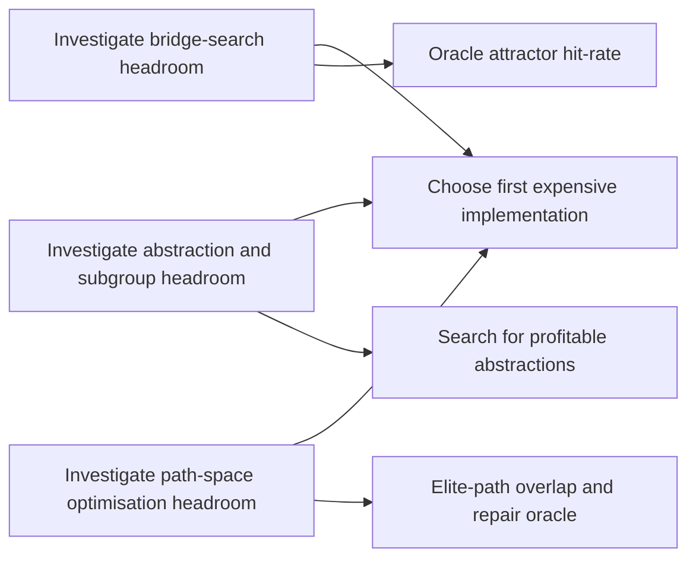

# Novel research directions for Kaggle Megaminx shortest-path

## Executive summary

What seems most promising is not another attempt to predict distance-to-go slightly better. The strongest expensive bets all change the *geometry of the search itself*: they either make the solver search from both ends and explicitly learn how to cross the middle, inject exact symbolic structure through discovered abstractions and subgroup tables, or optimise *whole candidate solutions* rather than only ranking frontier states. That conclusion follows both from your own context and from adjacent literature: recent large-cube work found that beam width and ensemble diversity mattered more than simply enlarging the train set, with average solution length dropping roughly linearly with log beam width and heterogeneous agents contributing unique wins on specific scrambles; the planning literature also argues that ranking and beam-awareness matter more than scalar cost regression when the real objective is search efficiency. citeturn39view0turn23view0turn23view2turn24view0

Because 60k implies roughly **60 moves per puzzle** against your stated **~75 moves now**, the target is not an incremental calibration problem. It likely requires at least one discontinuous mechanism that changes reachable neighbourhoods, creates bridge states, or performs non-local post-optimisation on already good solutions. The three directions I would put at the top are: **learned frontier-bridge bidirectional search**, **automatic abstraction and subgroup discovery with exact tables**, and **path-space optimisation via route relinking plus large-neighbourhood exact repair**. These are the ideas most likely to produce double-digit move savings rather than single-move polishing. citeturn31view3turn35view0turn27view1turn27view3turn15view0turn25view0turn25view1turn28view3

| Family | Why it could move the leaderboard | Resource profile | My verdict |
|---|---|---:|---|
| Learned bridge search | Attacks the hardest part of one-sided beam: “how do I cross the middle?” | Very high engineering, high compute | Highest upside |
| Discovered abstractions and exact tables | Injects new exact structure where neural value appears saturated | High memory, high offline search | Highest upside |
| Path-space optimisation | Improves full solutions non-locally instead of only frontier states | High engineering, selective exact compute | Highest practical upside |
| Macro-tree action search | Makes more of the search space visible per expansion | High model/search engineering | Strong supporting bet |
| Beam-aware utility training | Aligns learning with actual beam survival | Medium engineering, modest extra compute | Worth doing, but not enough alone |

## Problem restatement and bottlenecks

On your stated setup, this is a shortest-path competition over a very large permutation group with 24 primitive generators, scored by the **sum** of verified move counts over 1001 test puzzles. That means the optimisation target is not “solve hard instances eventually”; it is “shave average path length relentlessly across the whole test set”. In that regime, methods that are merely robust or merely fast are not sufficient if they do not materially alter average solution length.

The first bottleneck is that the obvious neural lane looks close to saturated. External cube results point the same way. In the CayleyPy work, increasing train-set size eventually produced little further reduction in average solution length, while beam width was the most important parameter and multi-agent diversity kept paying off; even agents that looked poor in aggregate still supplied the best solution on one or two scrambles and were therefore essential to the best ensemble. That is a direct warning against betting the whole project on better scalar prediction alone. citeturn39view0

The second bottleneck is that your current stack is still heavily *one-sided*: a strong value/policy/Q-guided beam is excellent at exploiting local preference structure, but it still needs to discover a thin bridge through the middle of the Cayley graph. Bidirectional search theory exists precisely because this bridge can dominate search cost; recent front-to-attractors work is notable because it keeps much of the informational benefit of front-to-front search while replacing the full opposite frontier with a small attractor set. Long-horizon RL work such as Search on the Replay Buffer arrives at a similar conclusion from a different angle: hard long-horizon problems become easier when the solver explicitly reasons through waypoints or bridge states. citeturn35view0turn31view3turn30view2

The third bottleneck is action-space expressivity. If the only searchable actions are the 24 primitive turns, then any deep motif must be rediscovered online as a long chain of local choices. Recent Q* results on Rubik’s Cube-style domains are striking here: when the action space was expanded with meta-actions, Q*-style search became much more attractive, and for the largest tested action space it matched the cheapest average path cost of A* while being 129 times faster and generating 1228 times fewer nodes. In offline RL for combinatorial action spaces, tree-structured action search was introduced for exactly this reason: to preserve higher-order action interactions without exhaustively scoring all combinations. citeturn22view0turn33view0turn33view1

The fourth bottleneck is that the final score may depend as much on *plan optimisation* as on state-space search. Planning research treats “find a plan, then improve it” as a separate algorithmic family because optimal search is often exponentially hard even with strong heuristics, while post-optimisation can exploit structure that constructive search misses. Large-neighbourhood search, route relinking, SAT-based bounded repair, and rewrite-based superoptimisation all point to the same idea: once you already have a good complete solution, the right search space is often the space of *related solutions*, not the raw state graph. citeturn28view3turn25view1turn25view0turn28view0turn36view3

## What the iterative search changed

| Search round | Where I looked | What changed my view |
|---|---|---|
| Cube and neural search | Rubik’s Cube papers, CayleyPy, DeepCubeA, EfficientCube, Q* | The literature reinforces your own observation: search-side economics dominate generic value-model tweaks |
| Planning, abstractions, bidirectionality | PDBs, landmark methods, meet-in-the-middle, macro-actions | The strongest missing ideas are structural and symbolic, not architectural |
| Outside the obvious neighbourhood | Route relinking, LNS, SAT/BMC, theorem proving, e-graphs, program synthesis | Whole-plan optimisation and equivalence-space search are underexploited and unusually relevant |

In the first round, I expected to find one or two underused value-learning tricks that could plausibly move the needle. Instead, the most important external signal was that recent cube work already behaves the way your internal observations suggest: beam width and diversity dominate; larger train sets plateau; and even “bad” agents remain valuable because strength is highly non-uniform across scrambles. In parallel, planning papers on ranking losses and beam-aware imitation kept repeating the same message: if test-time search is beam search or best-first search, training against scalar distance is a train/test mismatch. That changed the emphasis from “better value” to “better search control and better search basis”. citeturn39view0turn23view0turn23view2turn23view3turn24view0

In the second round, I looked for structural levers: pattern databases, abstractions, meet-in-the-middle, and action-space lifting. This produced two high-upside ideas. First, abstractions remain the strongest exact heuristic family in optimal planning, and new work in 2026 is explicitly about *learning admissible pattern generators by construction* rather than directly learning state values. Second, bidirectional search has acquired new practical surrogates such as attractor-based frontier representations, suggesting that full front-to-front costs are not the only way to exploit the opposite frontier. At the same time, the macro-action literature was a cautionary tale: macros can help dramatically, but only when their branching-cost problem is controlled. That pushed the next round toward methods that operate on *full solution paths*, where branching can be paid only on a shortlisted set of incumbent solutions. citeturn27view1turn27view3turn31view3turn34view0turn34view1turn22view0turn33view1

The third round was the most fruitful. Route relinking and large-neighbourhood search showed that many hard optimisation problems are improved most effectively by destroying and repairing parts of elite solutions, not by restarting from scratch. SAT planning and bounded model checking gave a clean symbolic mechanism for exact bounded repair. Equality saturation explained why many local post-processors stall: rewrite order itself is a hidden optimisation problem. Theorem proving then supplied a useful analogy for RL and expert iteration: once rewards are sparse and final verification is expensive, a *verifier in the loop* that supplies local exact feedback can be transformational. This round is where the report shifted decisively toward expensive, non-local ideas that could plausibly change the score scale rather than merely the slope of further progress. citeturn25view0turn25view1turn28view0turn28view1turn36view2turn36view3turn29view0turn29view1

## Research directions

| Direction | Main leverage | Cost | Timeline |
|---|---|---:|---|
| Learned frontier-bridge search | Changes one-sided search into bridge-seeking search | Very high | Medium |
| Automatic subgroup and abstraction discovery | Injects exact structure | High | Medium |
| Tree-structured macro action search | Enlarges reachable neighbourhoods safely | High | Medium |
| Beam-aware utility learning | Optimises for beam survival, not distance regression | Medium | Near-medium |
| Verifier-in-the-loop expert iteration | Gives dense, principled local credit | Medium-high | Near-medium |
| Population path search via route relinking | Searches in solution space | High | Near-medium |
| Large-neighbourhood exact repair | Non-local improvement of full plans | High | Medium |
| E-graph move superoptimiser | Global extraction over equivalence classes | Very high | Moonshot |
| Conditional PDB and landmark side-channel heuristics | Exact side information to stabilise beam search | High | Medium |
| Heterogeneous solver portfolio with routing | Exploits per-instance algorithm niches | High | Medium |

**Learned frontier-bridge search with attractors.** *Core mechanism:* maintain a forward beam, but also maintain a reverse bank of solved-side frontier states, shallow exact tables, or learned “attractors”; train a bridgeability model that estimates whether a forward state can be connected cheaply to one of those attractors, and score states by forward cost plus bridge cost plus reverse cost. This is the most direct way to attack the middle of the path, which is where one-sided value-guided beam tends to be most brittle. *Why it might beat your current AZ/value+beam setup:* it converts the hard long-horizon problem from “guess a whole suffix” into “find a short bridge to a known suffix family”. *Evidence:* MM and related bidirectional theory show why meeting in the middle is powerful; the new front-to-attractors work reduces pairwise frontier evaluations by up to 11.2 times while still cutting node expansions substantially versus front-to-end heuristics; SoRB solves long-horizon sparse-reward tasks by explicit waypoint planning; and practical Megaminx solver work already leans on meet-in-the-middle logic in late-stage decompositions. *What would make it fail:* reverse banks may be too diffuse, or the learned bridge metric may not correlate with true connectability. *Cheap validation gate:* on your existing giant-beam traces, measure the oracle fraction of frontier states that lie within a bounded bridge of a small reverse attractor set. If that oracle is weak, abandon. *Timeline:* medium-term. citeturn35view0turn31view3turn30view2turn15view0turn17view0

**Automatic subgroup and abstraction discovery.** *Core mechanism:* search over quotient spaces, subgroup targets, learned abstractions, or pattern collections that create exact or near-exact subproblems with tractable tables. The point is *not* to copy human F2L/S2L-style staging directly, but to discover machine-useful decompositions aligned with average move count. *Why it might win:* exact structure is the most obvious missing ingredient in a stack where generic learned guidance appears close to saturation. If you can discover just a few abstractions whose exact distances or target states strongly constrain the globally shortest path, you get a new information channel rather than another view of the same one. *Evidence:* pattern databases remain one of the strongest admissible heuristic families; automatic pattern construction has been effective for hard optimal planning domains; recent work now learns domain-specific pattern generators that remain admissible by construction; and the 2025–26 Megaminx solver project achieved average solutions around 82 twists with tens of gigabytes of precomputed staged data, explicitly noting both the power and the move-cost risk of decomposition. *What would make it fail:* decompositions that are excellent for upper bounds may still be bad for average path length. *Cheap validation gate:* search for abstractions on a held-out elite-solution corpus and ask whether exact abstraction distances explain residual error after your best neural score. *Timeline:* medium-term. citeturn27view1turn27view3turn26view3turn15view0

**Tree-structured macro action search.** *Core mechanism:* expand the action space from 24 primitive moves to a very large set of verified words, options, and context-conditioned macros mined from elite traces, subgroup solvers, or discovered motifs, then choose among them through a tree-structured Q or branch-value mechanism rather than naïvely scoring everything. This is not plain commutator replacement; it is a first-class enlarged action space with costed macro actions. *Why it might win:* to reach ~60 average, you may need to make deep motifs visible to search in one step. Primitive beams force the solver to rediscover those motifs online. *Evidence:* in Q* search, meta-actions make Q-guided search relatively stronger as the action space grows, and for Rubik’s Cube with 1884 actions Q* matches the cheapest path cost while being vastly cheaper than A* in time and node count; offline RL work such as BVE and BraVE exists specifically to handle combinatorial action spaces while preserving higher-order action interactions; classical planning shows macro-actions can speed search dramatically when selected well; and theorem proving now obtains large gains from automatically discovered higher-level tactic libraries. *What would make it fail:* action-space explosion and overfitting of the macro library. *Cheap validation gate:* mine a macro library from your best traces and test whether a tree-structured selector can improve shortest-found length at fixed search budget over a primitive-only control. *Timeline:* medium-term. citeturn22view0turn33view0turn33view1turn34view0turn29view1

**Beam-aware utility learning.** *Core mechanism:* replace scalar value regression with a training objective based on beam survival, beam ranking, or future usefulness under your actual inference procedure. The head should predict something like “probability this node remains on the Pareto frontier of solution quality under a width-B search and rescue stack”, not simply its remaining path length. *Why it might win:* your system already leans on beam search, shortlist Q models, rescue, and min-merge. That means state value is an intermediate variable; what you really care about is whether a node is *useful to the beam*. *Evidence:* planning theory now explicitly argues that ranking is more important than exact cost prediction for efficient search; beam-search imitation work shows the beam should be part of the model, not just a decoding artefact; older planning work on discriminative beam-search heuristics reached the same conclusion earlier; and L* loss improved A* by targeting excessive expansions rather than value error. *What would make it fail:* beam utility is policy-dependent, and labels from one beam regime may fail to transfer. *Cheap validation gate:* on frozen giant-beam traces, measure whether a beam-utility model improves top-k preservation of the final best solution compared with your best scalar head. *Timeline:* near- to medium-term. citeturn23view0turn23view2turn23view3turn24view0

**Verifier-in-the-loop expert iteration.** *Core mechanism:* generate labels from limited-horizon search plus exact local verification, then distil them into policy and utility heads. The signal should be local and search-grounded: bounded-horizon shortest frontier shortfall, exact action advantage under a restricted repair search, or probability of reaching a verified recoverable state. *Why it might win:* this is the principled version of your “short 100–500 epoch fine-tuning runs if there is a real signal” idea. It gives dense local targets without pretending that terminal reward alone is sufficient. *Evidence:* Expert Iteration separates planning from generalisation; limited-horizon Bellman learning improves heuristic training by using the best frontier descendant rather than a one-step backup; and theorem-proving work shows that local verifier feedback can improve global search when end-of-trajectory reward is sparse. *What would make it fail:* the expert remains too weak, so the learner just overfits search noise. *Cheap validation gate:* compare action-ranking recall on held-out hard frontiers using one-step Bellman labels versus limited-horizon verified labels. *Timeline:* near-medium. citeturn30view1turn30view0turn29view0turn32view0

**Population path search via route relinking.** *Core mechanism:* maintain an elite set of diverse complete solutions for each puzzle, embed them into a state-time overlap graph, and generate new candidates by traversing from one elite path towards another through shared or bridgeable states. This is broader than current relinking/min-merge because the unit of search becomes the *solution manifold*. *Why it might win:* if different search seeds find different rare good motifs, path relinking is a direct way to combine them without paying the cost of rediscovering each motif from scratch. *Evidence:* the path-relinking literature repeatedly describes it as a major intensification method that improves both solution quality and runtime distributions, and the GRASP/path-relinking literature specifically reports better results when relinking is applied as part of the search rather than only as a late clean-up; the planning literature treats replacement and removal of subsequences in existing plans as a major post-optimisation family. *What would make it fail:* your elite solutions may not differ in a structurally useful way. *Cheap validation gate:* construct the state-overlap graph for the best current solutions on a hard subset and estimate an oracle upper bound from recombining existing states only. *Timeline:* near-medium. citeturn25view0turn19search10turn28view3

**Large-neighbourhood exact repair.** *Core mechanism:* deliberately destroy large, correlated parts of a high-quality solution and repair them with a bounded exact planner, SAT/BMC encoding, CP-SAT model, or highly constrained meet-in-the-middle search. The repair neighbourhood should be larger than a static window and may allow reordering or alternative bridges through neighbouring states. *Why it might win:* reaching 60k probably needs non-local reorganisation, not just better local move cancellation. Large-neighbourhood search is designed for exactly this use case: reconsider a big chunk while keeping the rest of the incumbent. *Evidence:* LNS and very-large-scale neighbourhood search are successful because large destroy-repair moves reach better local optima; SAT planning reduces bounded plan existence to satisfiability; bounded model checking finds concrete bounded traces symbolically; and CP-SAT is explicitly designed to prove infeasibility or find optimal/feasible integer solutions in constrained subproblems. *What would make it fail:* bounded subproblems might still be too hard in the native Megaminx representation. *Cheap validation gate:* for two or three hard puzzles, delete 20–40 move regions chosen by a high-detour heuristic and test whether an exact bounded repair oracle can beat your current repair stack often enough to justify full engineering. *Timeline:* medium-term. citeturn25view1turn28view0turn28view1turn28view2

**E-graph move superoptimiser.** *Core mechanism:* compile move identities, cancellations, commuting fragments, inverse relations, and subgroup equivalences into an equality-saturation engine over move strings or local path DAGs, then extract the cheapest equivalent solution globally. This generalises greedy simplification into an optimiser over a whole equivalence class. *Why it might win:* many post-processors fail because local rewrite order is itself a hidden search problem. Equality saturation removes that phase-ordering pathology by representing many rewrite sequences simultaneously. *Evidence:* the original equality-saturation framework was introduced specifically to eliminate optimisation-order dependence; later e-graph superoptimisation work on tensor graphs applied all possible substitutions at once and found better final optima with far less optimisation time than sequential rewrite systems in that domain. *What would make it fail:* the useful rewrite algebra may be too state-dependent, leading to blow-up or weak extraction. *Cheap validation gate:* take a corpus of elite solution fragments and compare e-graph extraction against repeated greedy min-merge and cancellation. If the gap is trivial, stop. *Timeline:* moonshot. citeturn36view3turn36view2

**Conditional PDB and landmark side-channel heuristics.** *Core mechanism:* build compressed exact abstractions, landmark-progress signals, or small exact subgroup tables, then use them as side-channel features in beam ranking, tie-breaking, stage routing, or repair prioritisation rather than as a standalone admissible solver. *Why it might win:* exact and learned heuristics fail differently. A cheap exact side signal can rescue a beam from deceptive basins without forcing a full symbolic solver. *Evidence:* pattern databases remain central to high-quality admissible heuristics; Korf’s analysis ties memory roughly linearly to search-speed gains in Rubik’s Cube settings; landmark progression gives a general way to carry subgoal information through best-first search; and modern learned pattern-generator work shows that domain-specific abstractions can be discovered automatically rather than hand-crafted. *What would make it fail:* the side-channel may be too weak to justify lookup cost. *Cheap validation gate:* add a few candidate exact signals offline to a learned frontier-ranking model and test whether hard-frontier ordering improves at fixed beam width. *Timeline:* medium-term. citeturn27view1turn26view3turn26view2turn27view3

**Heterogeneous solver portfolio with learned routing.** *Core mechanism:* build genuinely different solvers — one-sided beam, bridge search, macro-tree search, abstraction-guided solver, and plan-space repair — then route puzzles or puzzle phases to them based on cheap diagnostics. *Why it might win:* a 1001-instance leaderboard rewards exploiting heterogeneity. If different scrambles are best attacked by different search geometries, a router can realise that advantage directly. *Evidence:* CayleyPy’s ensemble results show that agents with poor average quality still mattered because they uniquely won a few scrambles, which is exactly the portfolio argument in miniature; classical metaheuristics likewise gain from hybridising constructive search with intensification methods such as path relinking. *What would make it fail:* if all solver families are too correlated, routing adds overhead only. *Cheap validation gate:* compute an oracle portfolio upper bound using your current stack plus one or two prototypes. If the oracle gap is small, do not pursue learned routing. *Timeline:* medium-term. citeturn39view0turn25view0

## Ideas that sound tempting but are probably traps

| Trap | Why it sounds good | Why it is probably wrong |
|---|---|---|
| More generic value-model work | Easy to benchmark and familiar | External cube evidence points to plateauing train-set gains while beam width and diversity keep paying; your own experience says this lane is saturated |
| End-to-end RL from terminal reward | Feels “principled” and novel | Sparse terminal verification gives high variance and weak credit; the better recent work adds search-generated local labels or verifier feedback |
| Huge macro library without structured action search | Promises deep leaps | Macro-actions help only when branching is controlled; otherwise they drown the search |
| Copying human or published phase decompositions as-is | Symbolic structure is appealing | Even the Megaminx HPC project warns that decomposition tends to increase move count; upper-bound methods are not automatically average-length methods |
| Purely local post-processing | Cheap and often gives visible wins | Rewrite order itself becomes a bottleneck; equality-saturation work exists because greedy local rewrites miss interacting improvements |
| More beam alone | Often does help | It is necessary but probably not sufficient for a ~15-move-per-puzzle gain; it should support a new search basis, not substitute for one |

The evidence against the first trap is especially strong. CayleyPy found a clear stagnation effect with respect to train-set size, while beam width and agent count remained decisive. The literature on planning heuristics then piles on: search quality depends much more on state ranking and beam-awareness than on absolute cost-to-go estimation. This does not mean learning is unimportant; it means learning should target *search control* or *structural abstractions*, not just scalar accuracy. citeturn39view0turn23view0turn24view0

The macro and phase traps are subtler. Planning papers repeatedly warn that macro-actions enlarge the neighbourhood only if chosen selectively; otherwise they enlarge the branching factor faster than they help. Likewise, the Megaminx solver project explicitly notes that divide-and-conquer decomposition generally increases twist count even though it makes the problem computationally manageable. That is why I favour *automatic abstraction discovery* and *tree-structured action selection*, not “add more macros” or “copy the published stages”. citeturn34view1turn34view0turn15view0

The RL trap is also real. Expert Iteration, limited-horizon heuristic learning, and verifier-in-the-loop theorem-proving all point to the same lesson: learning becomes useful when search or a verifier supplies local, structured credit. Without that, the problem reduces to learning from extremely delayed feedback in a combinatorial search space where exact verification only happens at the end. citeturn30view1turn30view0turn29view0

## Search queries and prioritised research agenda

The search was done in grouped iterations. These were the exact query strings used.

**Round one queries**
```text
Kaggle Megaminx shortest path competition permutation puzzle 120 elements 24 generators
site:kaggle.com Megaminx shortest path competition Kaggle
Kaggle Santa 2023 permutation puzzle Megaminx shortest path
"A Machine Learning Approach That Beats Large Rubik's Cubes" code
site:arxiv.org "A Machine Learning Approach That Beats Large Rubik's Cubes"
site:speedsolving.com "A Machine Learning Approach That Beats Large Rubik's Cubes"
site:github.com diffusion distance beam search Rubik's cube
DeepCubeA paper Nature Machine Intelligence 2019 arXiv
EfficientCube solving Rubik's cube with deep reinforcement learning and search arXiv
site:github.com EfficientCube Rubik
Learning to Search with MCTS value policy cube
learned heuristic search planning pattern database neural A* beam search paper
offline reinforcement learning search control combinatorial optimization planning paper
differentiable beam search top-k training planning paper
learned bidirectional search meet in the middle heuristic planning paper
```

**Round two queries**
```text
pattern database heuristic Rubik's cube paper abstraction group theory
canonical pattern database additive abstractions planning paper
neural pattern database heuristic learning planning arxiv
compressed pattern database rubik's cube
route relinking combinatorial optimization path relinking paper shortest path local search
large neighborhood search solution repair routing paper
e-graphs optimization rewrite search theorem proving paper
SAT local search action sequence optimization planning paper
program synthesis search guidance learned model e-graphs theorem proving sequence repair paper
neural theorem proving search control beam search policy learning paper
proof repair route relinking search paper
superoptimization stochastic search equivalence classes e-graph paper
option discovery reinforcement learning subgoal discovery planning puzzle paper
macro actions planning learned macros paper classical planning
landmark heuristics planning search paper
learned subgoal search theorem proving verifier in loop paper
neural A* search differentiable planning paper arxiv
differentiable A* algorithm paper
learning to rank frontier states for search planning paper
search aware training heuristic beam search planning rank loss
```

**Round three queries**
```text
SAT planning local search improving plans action sequence optimization paper
bounded model checking planning shortest plan SAT paper
SMT planning optimization sequence repair paper
CP-SAT large neighborhood search exact subproblem repair paper
meet-in-the-middle search neural heuristic puzzle paper
frontier search pathfinding transposition table bidirectional heuristic paper
bridging states search learned midpoint planning paper
goal recognition bridge states planning heuristic
expert iteration combinatorial search planning paper offline RL search outcomes
search and learn offline theorem proving reinforcement learning planner
policy iteration with search outcomes beam search imitation paper
offline RL planning heuristic search discrete actions paper
speedsolving Megaminx solver optimal search forum
development of a megaminx solver speedsolving algorithm
Megaminx solver group theory search paper
speedcubing megaminx solver shortest path
Alexander Botz Megaminx solver pdf
site:github.com Alexander Botz Megaminx solver
"Megaminx Solver" Botz paper
site:tudarmstadt.de megaminx solver botz
equality saturation superoptimization exact extraction cost function paper
path relinking intensification stochastic local search combinatorial optimization review pdf
large neighborhood search destroy repair exact subproblem paper review
verifier in the loop local look ahead search exact repair paper
```

The most decision-changing sources were the CayleyPy paper on large-cube solving, the Q* and beam-aware/ranking papers from planning, the PDB and abstraction literature, the Megaminx HPC solver project, the route-relinking/LNS/plan-optimisation literature, and the theorem-proving/e-graph papers. I treated recent 2026 preprints as directional evidence, and the Speedsolving Megaminx thread only as community evidence rather than as a primary scientific source. citeturn39view0turn22view0turn23view0turn23view2turn27view1turn27view3turn15view0turn25view0turn25view1turn28view3turn29view0turn29view1turn36view3

The first three things to investigate, not implement, are these.

**First, investigate learned bridge search as a family, not a single model.** The question is whether your current winner traces contain a strong latent meet-in-the-middle structure that a reverse frontier bank or attractor set could exploit. If the oracle midpoint/bridgeability signal is weak, this whole lane should be deprioritised. If it is strong, it becomes the most exciting high-cost bet. citeturn31view3turn35view0turn30view2

**Second, investigate automatic abstraction discovery for Megaminx specifically.** The key question is whether there exist machine-useful abstractions or subgroup targets that are *better for average move count* than existing human or published staging choices. This is where I would spend serious thought before writing any code, because a good abstraction family could underpin exact side heuristics, bridge targets, macro discovery, and symbolic repair all at once. citeturn27view1turn27view3turn15view0

**Third, investigate path-space optimisation headroom.** Build the oracle studies first: overlap graphs of elite solutions, state-sharing statistics, and bounded destroy-repair oracles on hard scrambles. If those studies show large theoretical headroom, then a route-relinking plus LNS repair stack becomes a very credible “break the competition” angle. If not, you avoid an expensive engineering rabbit hole. citeturn25view0turn25view1turn28view3

