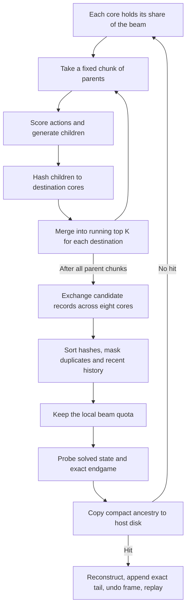

**TPU beam search: current implementation review, 5 September 2026**

The three requested Kaggle notebooks use the same JAX shared-beam architecture, adapted to two puzzles. Tetraminx 128M is a capacity experiment on the Tetraminx Q search. cube555 changes the model, state representation, endgame and search policy. A separate, measured TorchTPU implementation also exists locally.

This review downloaded all three current notebook sources, their latest available logs/results, and the small Python modules currently published in their artifact datasets. It also inspected the local builders, kernels, model adapters, handoff, experiment notes, training objective and validation scripts. Source snapshots and hashes are preserved in [the audit directory](C:/Users/and-l/cayley/.tmp/tpu_beam_review_20260905/audit_manifest.json). All eight successful downloaded solution paths were independently replayed against local competition states. No search implementation was changed or new accelerator run launched.

The downloaded dataset files are the currently served versions. They are not proof of the exact dataset revision used by every historical execution: the run outputs do not preserve a complete source manifest. Configuration and timing statements below distinguish current notebook code from observations in the retrieved logs.

**The actual notebook configurations differ from the local defaults.** Here M means 2^20 states.

| Setting | [Tetraminx Q](https://www.kaggle.com/code/artgor/cayleypy-tetraminx-tpu-beam-q) | [Tetraminx 128M](https://www.kaggle.com/code/artgor/cayleypy-tetraminx-tpu-beam-128m) | [cube555 Q](https://www.kaggle.com/code/artgor/cayleypy-cube555-tpu-beam-q) |
|---|---|---|---|
| Global beam | 64M | 128M | 16M |
| Model | PieceTransformer Q + ResMLP Q | Same | ResMLPQ, 24,757,807 parameters |
| Checkpoint | mx_tfaz_ep1500.pt + mx_resmlp_az.pt | Same | q555_2k_BEST.pt |
| Q blend | 0.8 / 0.2 | 0.8 / 0.2 | Disabled |
| Q/V consistency | 0.3 | 0.3 | 0 |
| State / actions | 88 int8 / 24 | 88 int8 / 24 | 150 uint8 / 30 |
| Parent chunk | 131,072 | 65,536 | 131,072 |
| Model batch | 16,384 | 8,192 | 16,384 |
| Receive oversampling alpha | 2 | 2 | 2 |
| Exact history rows | 1 | 1 | 4 |
| Endgame | d <= 6, 27,779,749 entries | Same | d <= 5, 10,739,017 entries |
| Explicit inverse-move filter | Off | Off | Off |
| Maximum stored levels | 60 | 60 | 300 |
| Frames | One randomly selected spatial/inverse frame | k0 forward | k0 forward and k7 inverse; keep best |
| Puzzle selection | Random group from an embedded list | First entry of a GitHub list | 1034, 1020 |
| Tree location used by solve | /tmp | /tmp | /tmp |

The 128M frame is fixed, but its puzzle ID depends on an external mutable list; the retrieved run selected pid 291. Its printed tree-location warning still incorrectly says /kaggle/working. The actual tree path in its solve cell is /tmp.

The local Tetraminx Q notebook uses 16M, two fixed frames and pids 990–993. The local cube555 notebook uses 2M. The local 128M notebook explicitly enables UNPACKED_EXCHANGE; the currently downloaded Kaggle 128M notebook does not. These are substantive code differences, confirmed by comparing parsed Python syntax as well as text.

**How one search step works.** The main entry point remains named beam_solve_v_only_spmd_packed even when q_mode is enabled. All three linked notebooks select its streaming body.

For N devices, each core holds L = B_global/N states. Every sender retains K = alpha*L/N candidates for each destination. With eight devices and alpha=2, each owner receives 2L candidates and retains L slots.

Ownership is a deterministic function of the child state. The current notebooks supply a uint32 dot-product hash; its low three bits select the owner. Copies of a state from different parents or cores therefore meet on the same destination. A separate int64 dot-product hash handles deduplication/history, while the endgame uses its own Zobrist hash.

This is a globally communicating beam with fixed owner quotas. It is not mathematically identical to selecting the best B unique states from the entire global child set. Sender-to-owner quotas can discard candidates before global deduplication, and every owner has a fixed L-slot allocation. Alpha provides slack for duplicate removal and imbalance; it is part of the search policy, not just a memory setting.

**V and Q differ in where neural work occurs.** V mode evaluates the generated children: approximately g*L input rows per core per step, for g generators. Direct Q evaluates L parent rows and emits g action scores per row. Lower scores are preferred. These are distance-like action values, not move probabilities.

Tetraminx trains this head with sparse random-walk supervision: at a pivot p, the undo action receives p-1 and the next walk action p+1. Exact BFS anchors and symmetry expansion supplement those labels. This supplies a consistent directional learning signal, although walk indices are not guaranteed shortest-path distances.

The transformer loader folds the piece input projection into an embedding lookup table. It gathers the facelets for 50 pieces, constructs piece tokens and a class token, then applies attention blocks and Q/value heads. Model inference is batched inside the parent-chunk loop. The deployed Tetraminx ranking score is:

    q = 0.8 * Q_transformer(s,a) + 0.2 * Q_resmlp(s,a)
    score = q + 0.3 * abs(q - (V_transformer(s) - 1))

The value comes from the first blend member with a value head; it is not averaged across members. Both transformer heads share one trunk pass. cube555 uses its ResMLP Q output directly, with no blend or consistency penalty in the downloaded notebook.

Direct Q saves neural evaluation, but the current streaming body still generates and hashes every action's child, one parent chunk at a time. It is not the adaptive progressive top-k implemented in the local GPU solver. The historical TPU Q-mode comparison in [HANDOFF.md](C:/Users/and-l/cayley/tetraminx/HANDOFF.md:1778) reports about 20 s/puzzle versus 42–53 s for V at the tested width. The frequently repeated approximately 22x figure belongs to a different local GPU comparison and must not be used as the speedup of these Kaggle runs.

**Streaming bounds the child block, but retains large candidate pools.** Each parent chunk produces all g*C children. For each of eight destinations, the kernel selects K candidates from the previous K winners concatenated with the new chunk's masked scores. It then gathers old/new states and rebuilds the running candidate records. After all chunks, one packed uint8 all_to_all exchanges the final buckets.

Tetraminx records contain 88 state bytes, four parent-local bytes, one move byte and two bf16 score bytes, padded to 96. cube555 uses 150 state bytes and the same metadata, padded to 160. Sending the score is required for direct Q: the receiving core has a child state, whereas the relevant action score was produced from its parent.

The receiver sorts by the int64 hash, masks adjacent duplicates and recent history, then applies a final top-k. Exact history is stored locally because deterministic ownership sends a revisited state to the same core. It uses a custom binary search rather than dynamic-size unique operations. An approximate history bitmask also exists but is disabled in these notebooks.

**The main arrays have different scaling behavior.** These are logical payload sizes, not measured peak HBM; compiler padding, simultaneous buffers, sorting/gather scratch and model activations are additional.

| Allocation | Tetraminx 64M | Tetraminx 128M | cube555 16M |
|---|---:|---:|---:|
| Local frontier, L x state size | 704 MiB | 1,408 MiB | 300 MiB |
| One generated child chunk | 264 MiB | 132 MiB | 562.5 MiB |
| One send OR receive record pool, 2L records | 1,536 MiB | 3,072 MiB | 640 MiB |
| Local exact history | 64 MiB | 128 MiB | 64 MiB |
| Parent chunks per step | 64 | 256 | 16 |
| Global ancestry transfer per level | 256 MiB | 512 MiB | 64 MiB |
| Maximum host tree file | 15 GiB | 30 GiB | 18.75 GiB |

Model parameters, generator permutations, hash constants and endgame lookup keys are available on each core. Frontiers and history are sharded. Search-state buffers are donated to the compiled step to permit reuse. The full ancestry tree lives in a host memmap, with a four-byte packed backpointer per state per level: 24 parent-local bits, three parent-rank bits and five move bits. Thus 128M on eight cores is exactly the current parent-index capacity limit.

The 64M-to-128M change doubles L and K but halves C. It therefore quadruples the number of chunks and doubles the running pool processed in each chunk: eight times the logical visits to retained bucket records. That is a structural scaling observation, not a measured eightfold runtime prediction. Smaller child chunks can relieve one memory term while increasing selection and record-handling work substantially.

**The endgame replaces the last part of neural search.** Selected survivors are checked against solved and the sorted Zobrist-key table. On a hit the host follows backpointers, generates the exact descending tail from the reached state, maps moves out of the symmetry/inverse frame and replays the complete path against the original scramble. The exact tail does not imply the complete solution is shortest.

The JAX solver stops at the first layer with a hit, selects the first hit in a core's score-ordered beam and resolves cross-core ties by rank. It does not minimize beam depth plus exact remaining depth across all hits. It also probes selected survivors, not every generated child. Those distinctions matter when reasoning about path quality. The notebook runs its requested frames separately and takes their minimum afterward; the shared beam pools cores, not frames.

**What the retrieved runs actually demonstrate.** All logs report JAX 0.10.2 and eight TPU v5-lite devices; notebook metadata identifies the Kaggle TpuV5E8 machine shape.

| Run | Retrieved evidence |
|---|---|
| Tetraminx 64M | Six puzzles, frame (9, forward), lengths 28/30/29/29/29/29; all independently replayed. Median device time among logged steps >=10: 198.95 s. Median copy plus write: 0.325 s. Search-only time across six calls: 26,672.5 s (7.41 h). |
| Tetraminx 128M | pid 291, k0 forward. Fails in compilation before any search step. Compiler reports 25.94 GiB program requirement against 15.75 GiB available HBM. No successful path in the retrieved output. |
| cube555 16M | Forward solves: pid 1034 in 116 moves and pid 1020 in 120 moves, both independently replayed. Both k7 inverse attempts fail to find a solution within the 300-level allocation. Median device time among logged steps >=10: 31.0 s; copy plus write: 0.08 s. |

The latest 128M [allocation report](C:/Users/and-l/cayley/.tmp/tpu_beam_review_20260905/logs_cayleypy-tetraminx-tpu-beam-128m/log_decoded.txt:80) identifies three s32[16777216,1] temporaries. Each has a 64 MiB logical payload but an 8 GiB padded allocation, a 128-fold expansion. Their aggregate 24 GiB dominates the reported program memory. The displayed tree-disk warning is not the cause of this compile failure. The allocation log does not uniquely identify the Python expression responsible for every padded temporary, so mapping it to a specific fix still requires compiler-level evidence.

The logged device timer includes the compiled search step. It does not split model, top-k, record packing, hashing, history and collective time. It does establish that host ancestry copying/writing is a small fraction of these successful steps. Each Tetraminx puzzle also recompiles for 104–121 s; cube555 calls compile for 122–146 s. The wrapper recreates its compiled closure per solve, and these downloaded notebooks do not configure the persistent cache that the local GCP driver enables. Reported successful wall_s excludes lowering/compilation and notebook-level tail work, so it is not the full session cost.

**Several local approaches are at different stages of deployment.**

| Approach | Location and current status |
|---|---|
| Packed V/Q engine and streaming | [Main local engine](C:/Users/and-l/cayley/tetraminx/kaggle_notebooks/tpu_beam_tetraminx/jax_beam_spmd_v_only.py:451); shared origin of both puzzle ports. The uploaded Tetraminx copy differs from it. |
| Preselection before child construction | pre_topk_mult in the main local engine; fixed top-M, not the GPU's adaptive doubling loop. Non-streaming only. HANDOFF records +33% wall at 1M and +110% at 32M on the cited worksets with unchanged paths. Off and absent from the currently downloaded Tetraminx dataset engine. |
| Four typed exchanges | UNPACKED_EXCHANGE in the [downloaded dataset engine](C:/Users/and-l/cayley/.tmp/tpu_beam_review_20260905/tetraminx_dataset/jax_beam_spmd_v_only.py:55), default false; enabled by the local 128M notebook but not its downloaded counterpart. Carries state, parent, move and bf16 score separately to avoid byte assembly. Local comments claim favorable memory measurements and CPU parity; the retrieved Kaggle log does not validate that variant. |
| Deferred receive-state gather | PHASE_E in the [local staged dataset engine](C:/Users/and-l/cayley/tetraminx/kaggle_datasets/tetraminx-tpu-artifacts/jax_beam_spmd_v_only.py:62), default false; absent from the downloaded dataset. Composes sort and selection indices before gathering states, avoiding a full receive-pool state permutation. |
| Columnwise cast for endgame hashing | Present in current Tetraminx dataset and main engine. cube555's local source has the change, but its downloaded dataset still casts the whole chosen frontier to int32 first. |
| Pure TorchTPU | [beam_tpu.py](C:/Users/and-l/cayley/tetraminx/src/tetraminx/beam_tpu.py:66) and [47_beam_tpu.py](C:/Users/and-l/cayley/tetraminx/scripts/47_beam_tpu.py:46). Direct Q, static masks, four typed collectives, explicit valid slots and exact endgame. No parent-child streaming, history or consistency policy in the current search class. Ancestry stays in device-side lists until gathered. |

The recorded [TorchTPU comparison](C:/Users/and-l/cayley/TORCHTPU_FINDINGS.md:327) is six puzzles at 1M global on four v6e chips: JAX 185 moves/345 s, TorchTPU 186 moves/1,973 s, with valid paths. This supports similar aggregate quality on that small workset and a 5.7x wall disadvantage for that TorchTPU implementation. Its profile attributes most time to the model; that finding cannot be transferred to the very different 64M streaming JAX workload.

**Search semantics worth preserving or testing before optimization.** These are observations from the code, with no claim that changing them has already improved a real run.

- Deduplication keeps the first occurrence in hash-sorted receive order, not the minimum-score occurrence. This distinction was less consequential for state-only V; direct Q and parent-value consistency can give different scores to paths reaching the same child. Candidate selection can depend on which predecessor's copy survives.
- In JAX, masked entries remain in fixed-size arrays and chosen_is_real checks nonzero state content rather than the selected score. When fewer than L admissible unique states remain, top-k must fill the remaining slots, and a masked nonzero state can re-enter the frontier. The TorchTPU version explicitly propagates new_valid from the selected score. No occupancy statistics in the retrieved logs establish the practical frequency or impact in the large runs.
- bf16 scores travel through candidate records. Close values can tie before receive-side selection; numerical parity and tie behavior are part of search quality, not merely inference accuracy.
- Resume completion is based on the count of records for a pid, not exact (pid, symmetry, inversion, configuration) keys. Failure records count, and the exception branch continues before writing the JSON. The all-failure 128M output has no results JSON. These details affect reproducibility and whether a campaign's output is complete.
- Each downloaded notebook defaults BASELINE_CSV to None and fills untouched rows from the competition sample. The produced full-file total therefore includes fallback paths; it should not be interpreted as the beam's performance on the whole test set. The six Tetraminx and two cube555 solved paths are the actual newly verified results here.

The established design is strong at distributing one large search, using parent-level Q to reduce model work, exploiting exact endgames, and reconstructing paths without keeping the full tree in HBM. The current evidence separates the next questions cleanly: 128M is limited by a demonstrated compiler-padding failure; wide streaming has substantial repeated candidate-record work; and search quality depends on quotas, duplicate handling, endgame selection and puzzle-specific frame/history policy. None of the retrieved runs is a matched 64M-versus-128M quality comparison.
